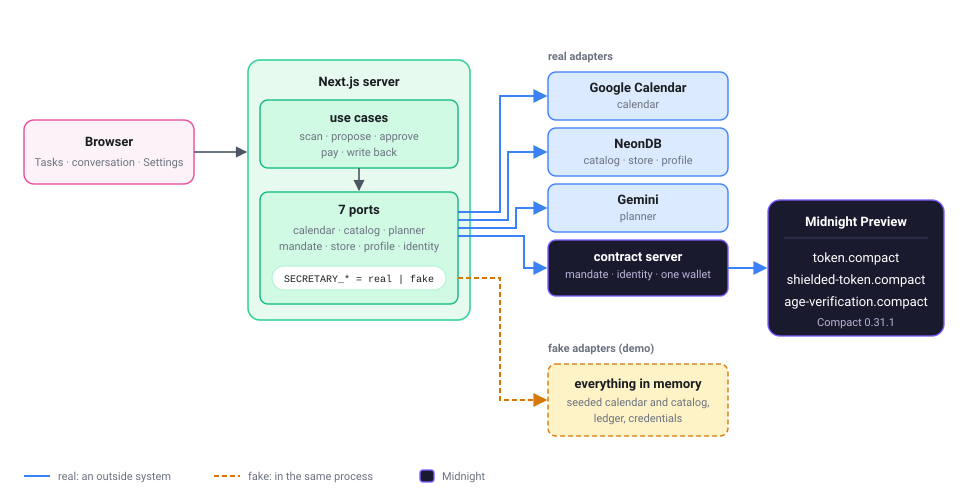

# Zee-Kwat Private Agent (ZKP Agent)

An AI secretary that arranges business trips off your calendar and pays for them on Midnight.
Built by Team Gecko for the Midnight Buildathon.

It reads the next 30 days of your Google Calendar, spots the trips nobody has arranged yet, and puts a
plan together for each one -- transport, a hotel if you're staying over, somewhere to eat, somewhere to
go -- within your budget and tastes. You approve once. It pays each booking out of an allowance held in
a Midnight contract and writes the itinerary back to your calendar.

Two things run on Midnight, not just next to it:

- **Paying.** You give the secretary a spending limit once. A Midnight contract holds that limit and
  pays each booking from it, and it refuses anything over the limit -- the app can't talk it into
  more. A booking you mark "keep private" is paid with a shielded token, so the ledger doesn't show
  who got paid for dinner.
- **Proving your age.** An izakaya needs to know you're 20 or over. Instead of showing your date of
  birth, the secretary sends a zero-knowledge proof that answers one question -- "born on or before
  this date?" -- with a yes or a no. Your date of birth stays with you; the chain only holds a
  commitment to it.

## Start here

| To see | Go to | Takes |
| --- | --- | --- |
| It running on your machine, nothing else set up | [Demo](#demo-no-google-project-database-llm-key-or-midnight-node) | 5 min |
| What the contracts hold and hide | [Midnight integration](#midnight-integration), then `contract/compact/` | 10 min |
| What the tests and CI prove | [Tests and CI](#tests-and-ci) | 2 min |
| A real settlement on Midnight Preview | [With Midnight Preview](#with-midnight-preview-real-payments) | 30 min plus the first sync |

## What's real and what's a stand-in

Every port has a real adapter and an in-process fake. `SECRETARY_MODE=demo` picks every fake; unset
picks every real adapter; a per-port variable overrides either ([table](#source-variables) below).
Each page of the app says which fakes it's running on.

| Port | Real | Fake (demo) |
| --- | --- | --- |
| auth | Google sign-in | dev sign-in button (localhost only) |
| calendar | Google Calendar API | seeded events in memory |
| catalog | NeonDB service tables | the same shape, seeded in memory |
| planner | Gemini picks the trips and the offers | a deterministic planner that reads the event title |
| mandate | `token.compact` / `shielded-token.compact` via the contract server | an in-memory ledger with the same public/private split |
| store | NeonDB `trips` / `trip_items` | in memory |
| profile | NeonDB `user_profiles`, wallet address from a connected Midnight wallet | one fixed profile, editable in memory |
| identity | `age-verification.compact` via the contract server, one pseudonym per traveler | an in-memory credential registry |

In demo mode the age check and the private payment happen in the fakes: they show the flow but prove
nothing. `SECRETARY_MANDATE=real` makes the payments real transactions on the Midnight Preview network.
`SECRETARY_IDENTITY=real` makes the circuit, the proof and the on-chain record real, with one catch
described under [What we don't claim](#what-we-dont-claim).

## Architecture



The use cases are pure functions over the ports; I/O, the clock and ids come in as arguments. That's
what lets the same code run against the fakes in tests and demo mode, and against Google, Neon, Gemini
and Midnight otherwise. `SECRETARY_*` is read once at start, and a bad combination refuses to boot.

The Next.js server never imports the Midnight SDK. A small contract server in `contract/` keeps one
wallet synced and the three contracts connected, and the app calls it over loopback. The wallet sync
is paid once at start instead of per request, and the SDK's module graph stays out of the app's. The
only Midnight package in the app is the DApp Connector API, used in the browser to read the connected
wallet's address.

## Midnight integration

Three Compact contracts, compiled with Compact 0.31.1 (`contract/scripts/compile.sh`, same version in
CI). For each: what stays private, what the ledger holds, which calls are transactions.

### `token.compact`: the allowance and public payments

| | |
| --- | --- |
| Witness | `getOwnerSecretKey()`. The ledger holds only `contractOwner`, a hash of it |
| Ledger | `_name`, `_symbol`, `tokenColor`, `supplyMinted`, `sendAllowance` (the remaining budget) |
| Transactions | `mintSupply` (owner, once), `setSendAllowance` (owner), `sendToken(recipient, amount)` (owner: asserts `amount <= sendAllowance`, subtracts, sends unshielded -- one circuit) |
| Reads | `getTokenInfo` bundles the getters into one call |

Each public payment is one `sendToken`. The owner check, the budget check, the decrement and the
transfer are one circuit, so a payment can't be authorized without being paid, or paid without
counting against the budget. The transaction id comes back to the conversation as the payment's
public hash. A fresh deployment has an allowance of 0 on purpose: a leaked agent process on a new
contract has no budget rather than the whole supply (`SEND_ALLOWANCE` in `contract/.env`,
`npm run set-allowance`).

### `shielded-token.compact`: private payments

| | |
| --- | --- |
| Witnesses | `minterSecretKey()` (ledger holds only the derived `minter`), `localNonceSeed()` (each coin's nonce comes from it, never published) |
| Ledger | `token_color`, `initialized`, `mints`, `minter`, `mintAllowance` |
| Transactions | `setMintAllowance` (minter), `mint_and_send(recipient, amount, nonceIndex)` (minter: asserts `amount <= mintAllowance`, mints a shielded coin, sends it) |

A booking marked "keep private" settles with `mint_and_send` instead of `sendToken`. What reaches the
public transcript is written above the circuit in the source: the amount is public (every mint feeds
the supply count), the recipient isn't (only a hash of the coin and the recipient key is, and the nonce
inside it comes from the witness). The real mandate adapter says whether it supports private
settlement, and the toggle hides when it doesn't.

### `age-verification.compact`: an age without the date of birth

| | |
| --- | --- |
| Witnesses | `dateOfBirth()` (`YYYYMMDD` in a `Uint<32>`), `dobSalt()` (about 40,000 plausible birthdates, so an unsalted hash would be brute-forced), `identitySecret()` |
| Ledger | `registrations: Map<identity, commitment>` |
| Transactions | `register()` (once per identity: stores `persistentCommit(dob, secret, salt)`; no re-registration, so a birthdate can't be swapped once a cutoff is known), `proveAdult(cutoffDate)` (checks the witness against the commitment, returns `disclose(dateOfBirth() <= cutoffDate)`) |

| The verifier learns | The chain keeps | Stays with the holder |
| --- | --- | --- |
| yes or no for one cutoff date, and which identity answered | the commitment, the identity (a hash of the secret, not a wallet address), the transaction | the date of birth, the salt, the identity secret |

`proveAdult` returns the answer instead of asserting on it, so a "no" is a result a merchant can see,
not a failed transaction that looks like a network error. The circuit has no clock; the cutoff comes
from the verifier. The secretary uses the departure date minus the place's age limit (20 for an
izakaya).

In the app: you issue a credential from the profile page (`register`). When a plan includes an
age-restricted place, approving it first asks whether the secretary may send the proof. If the proof
fails, the secretary offers to rebuild the plan without that place rather than dropping the trip. The
date of birth is never shown to the AI planner.

## What we don't claim

So this README can't promise more than the code does.

- **Who holds the age secrets.** With `SECRETARY_IDENTITY=real`, the app names you by an opaque
  pseudonym, and the contract server derives your identity secret and salt from it and receives your
  date of birth over loopback when the credential is issued. The proof is real and per traveler, but
  the holder is the server, not you. The real shape keeps the secrets on your side and proves from the
  connected wallet.
- **Public payments are public.** `sendAllowance` and every `sendToken`'s amount and recipient are
  readable on chain. The ledger panel's picture (count public, cap and spent private) is exact for the
  in-memory ledger, not for real public payments. "Keep private" hides the recipient; the minted
  amount is still public.
- **One fixed payee.** The catalog's payees are placeholder strings, so every real payment goes to
  `MANDATE_SETTLEMENT_RECIPIENT` (or its shielded twin). The conversation records the catalog's payee
  separately.
- **One owner, one allowance.** A `token.compact` deployment has one owner key and one
  `sendAllowance`. The cap you grant the secretary is checked by the mandate adapter in the app, not
  by the contract.
- **The escrow is not on chain.** A booking you have paid for is marked "held" until you press
  **I received this**, and the sidebar shows the money move from the secretary to the payee. That hold
  lives in the app's state, not in a contract: the token has already left the allowance at payment
  time, so confirming a receipt moves a label, not a coin. Putting deposit-on-booking and
  release-on-confirmation into a circuit is the next step, not this one.
- **Which identity proved is visible.** The registration map's key is a public argument to its
  `member()` / `lookup()`, so repeated proofs by the same pseudonym are linkable. A Merkle tree of
  commitments would hide it; noted in the circuit's comments, not built.
- **Preview, not mainnet.** The three contracts are deployed on Midnight Preview (addresses under
  [With Midnight Preview](#with-midnight-preview-real-payments)); nothing is on mainnet. The
  settlement numbers under [Tests and CI](#tests-and-ci) were measured on a local devnet.
- **The first sync is slow.** The contract server's wallet replays Preview from genesis the first
  time (hours; the local devnet took seconds). `contract/.wallet-cache` keeps the shielded and
  unshielded state between runs, but the DUST wallet always starts cold.
- **Demo mode's clock.** The demo profile's date of birth is fixed at server start, so a demo server
  left running past midnight lets the wrong trip pass. Restart it for a new day.
- **Not audited.** Three weeks of hackathon.

## Setup

Node.js 24 is pinned with [mise](https://mise.jdx.dev/):

```bash
mise trust     # trust this repository's mise.toml
mise install   # install the pinned Node.js
npm install    # dependencies and git hooks
```

## Run it

The whole path runs with every port real: Google Calendar, NeonDB, Gemini, and Midnight Preview for
both the payments and the age proof. You can walk the same path on your machine in demo mode, where
everything is faked and nothing else needs setting up.

### Demo: no Google project, database, LLM key, or Midnight node

```bash
cp .env.example .env.local
# .env.local: set NEXTAUTH_SECRET (openssl rand -base64 32) and uncomment SECRETARY_MODE=demo
npm run build
npm start
```

Open [http://localhost:3000](http://localhost:3000) and use the dev sign-in button. Then open
**Tasks** ([/en/tasks](http://localhost:3000/en/tasks)), press **Scan the calendar**, and open
大阪出張 (取引先訪問) (an Osaka trip to visit a client) with **Ask the secretary**. From the reply
buttons: propose (the first proposal also sets up an allowance), approve, pay, add to the calendar.
Back in **Tasks** the trip moves from **Trips in progress** to **Confirmed trips**, and the written-back
event no longer shows up in a scan.

The ledger panel next to the conversation counts each payment on the public side while the cap and
the spent amount stay private. Everything lives in memory; restart and it starts over. The dev sign-in
trusts whoever clicks it, so it only turns on when `NEXTAUTH_URL` points at localhost.

### With your own Google Calendar

1. In Google Cloud Console, create a project and enable the Calendar API.
2. Create an OAuth client (Web application) with redirect URI
   `http://localhost:3000/api/auth/callback/google`, and add yourself as a test user.
3. In `.env.local`, set `GOOGLE_CLIENT_ID`, `GOOGLE_CLIENT_SECRET`, `NEXTAUTH_SECRET`,
   `NEXTAUTH_URL=http://localhost:3000`, and leave `SECRETARY_MODE` unset.
4. `npm run build && npm start`, sign in with Google, open **Tasks**, scan.

To keep the real calendar and fake the rest, set the ports you don't have, e.g. `SECRETARY_CATALOG=fake`.

### With Gemini as the planner

Set `GEMINI_API_KEY` (Google AI Studio) in `.env.local`, keep `SECRETARY_MODE=demo`, add
`SECRETARY_PLANNER=real`. Gemini only decides whether an event is a trip, which destination, and which
offer ids to pick; dates come from the event and prices from the catalog. `GEMINI_MODEL` overrides the
default (`gemini-3.5-flash-lite`).

### With Midnight Preview (real payments)

The contracts are deployed on Preview:

| Contract | Address |
| --- | --- |
| `token.compact` | `151f2e5b963e82fbf6c69659f19470cd15ffacf41fcf4ea7d8924cd74af10d54` |
| `shielded-token.compact` | `1803ad848d2956fa045381e838550bc5559fd1a37ff07443df2501ca213508fa` |
| `age-verification.compact` | `88771671d34d963095f71c367ed7341673f28bb94865f83a0836833b0da43a5c` |

Only the deployer's key can call `sendToken` / `mint_and_send` (the owner check in the circuits), so a
contract server that pays needs the deployer's `DEPLOYER_SEED`. Without it, deploy your own copy: same
steps, your own addresses.

Needs Docker (for the proof server) and Compact 0.31.1: install the `compact` CLI with the
[installer](https://github.com/LFDT-Minokawa/compact#installation) (the script is still served from
the `midnightntwrk/compact` releases), then `compact update 0.31.1`.

```bash
docker compose -f devnet.yml up -d --wait proof-server   # proving stays local; node and indexer are Preview's
cd contract
npm install
npm run compile:full                          # circuits, TypeScript bindings and proving keys
cp .env.example .env                          # NETWORK_ID=preview and the Preview URLs are the defaults
                                              # DEPLOYER_SEED (openssl rand -hex 32), never committed
npm run address                               # the deployer's unshielded address: fund it from the faucet
npm run register-dust                         # turns some NIGHT into fee DUST
npm run deploy                                # token.compact: deploy, mintSupply, setSendAllowance
npm run deploy-shielded-token
npm run deploy-age-verification
```

Skip the three deploys if you have the deployer's seed for the addresses above. Put the addresses into
`contract/.env` (`TOKEN_ADDRESS`, `SHIELDED_TOKEN_ADDRESS`, `AGE_VERIFICATION_ADDRESS`), then start
the contract server in `contract/`:

```bash
NODE_OPTIONS=--max-old-space-size=6144 npm run server
```

The first start walks Preview from genesis (about 900,000 blocks at the time of writing, hours, and
more heap than Node's default, hence `NODE_OPTIONS`); the log prints the sync position every few
seconds. The shielded and unshielded state is saved under `contract/.wallet-cache` (git-ignored) when
the sync finishes or the server is stopped, so later starts resume from there; the DUST wallet, which
pays the fees, always syncs from scratch. Root's `npm run dev` starts the same server alongside
Next.js. Then at the root:

```bash
SECRETARY_MODE=demo SECRETARY_MANDATE=real \
  NEXT_PUBLIC_MIDNIGHT_NETWORK_ID=preview \
  MANDATE_SETTLEMENT_RECIPIENT=<an unshielded address, mn_addr_preview1...> \
  MANDATE_SETTLEMENT_RECIPIENT_SHIELDED=<a shielded address, mn_shield-addr_preview1...> \
  npm start
```

Each payment takes about 20 seconds of proving on the local devnet; Preview adds the network's own
confirmation time. Add `SECRETARY_IDENTITY=real` to run the age proof through the contract too
(`AGE_VERIFICATION_SEED` pays its own fees, so fund it from the faucet as well). Private payments mint
shielded coins, and `npm run shield` turns some of the deployer's NIGHT into shielded NIGHT for their
fees (Preview has no genesis wallet to fund from). Connect Wallet on the profile page targets
`NEXT_PUBLIC_MIDNIGHT_NETWORK_ID`.

To run against a local devnet instead: `docker compose -f devnet.yml up -d --wait` starts node, indexer
and proof server on 127.0.0.1; set `NETWORK_ID=undeployed` and the 127.0.0.1 URLs in `contract/.env`
(kept there as comments), fund the deployer with `npm run fund -- <address> 100000` (genesis NIGHT;
1000 isn't enough for DUST) instead of the faucet, and use `NEXT_PUBLIC_MIDNIGHT_NETWORK_ID=undeployed`.
`docker compose -f devnet.yml down` discards that chain, so redeploy after it.

### Source variables

| Variable | Values | Default |
| --- | --- | --- |
| `SECRETARY_MODE` | `normal` \| `demo` | `normal` |
| `SECRETARY_AUTH` | `google` \| `dev` | from the mode |
| `SECRETARY_<PORT>` (`CALENDAR`, `CATALOG`, `PLANNER`, `MANDATE`, `STORE`, `PROFILE`, `IDENTITY`) | `real` \| `fake` | from the mode |

A per-port variable beats `SECRETARY_MODE`, which beats the default (everything real). Each real port
reads its own variables from `.env.local` (see `.env.example`); a missing one doesn't stop the server,
that port's calls just fail:

| Port | Variable | Read when |
| --- | --- | --- |
| catalog | `DATABASE_URL` | the first catalog query |
| planner | `GEMINI_API_KEY`, `GEMINI_MODEL` (optional) | every proposal |
| mandate | `MANDATE_SETTLEMENT_RECIPIENT`, `MANDATE_SETTLEMENT_RECIPIENT_SHIELDED` (optional: without it the private toggle hides) | every payment |
| profile (Connect Wallet) | `NEXT_PUBLIC_MIDNIGHT_NETWORK_ID` (`preview`) | the wallet extension's connect call |
| profile | `DATABASE_URL` | the age proof reads the date of birth from the profile |
| identity | `AGE_VERIFICATION_ADDRESS` (in `contract/.env`, read by the contract server) | issuing the credential and every proof |

`SECRETARY_STORE=real` writes confirmed itineraries to NeonDB and reads the Confirmed tab from there;
trips still in progress live in memory. It needs `SECRETARY_CATALOG=real` too, since each line item
points at the catalog row it was booked from; with the fake catalog the calendar entry still succeeds
and the conversation says the itinerary couldn't be saved.

## Tests and CI

```bash
npm test               # vitest: 55 files, 731 tests, about five seconds, no network
npm run typecheck      # next typegen + tsc
npm run lint           # Biome
npm run i18n:report    # keys in en.json but not ja.json, and the reverse
```

The tests need no database, key or node. I/O comes in as arguments, so the tests pass the same fakes
demo mode runs on, and the use cases run end to end (scan, propose, approve, pay, write back, the age
check, the rebuilt plan) as state in, state out. Tests sit next to the code: `src/domain` (money,
dates, plans), `src/application` (use cases, wiring), `src/adapters` (fakes, Gemini prompts and
parsing, Google Calendar, Neon rows, the real mandate and identity adapters against a stubbed contract
server), `src/server` (route handlers, page loaders), `src/components` and `src/features` (views).

The circuits have no simulator tests yet; CI checks that they compile and that the generated bindings
typecheck.

CI (`.github/workflows/ci.yml`, on every pull request):

- `check`: `npm ci`, typecheck, lint, tests.
- `compact`: Compact 0.31.1 via `midnightntwrk/setup-compact-action`, compiles every contract under
  `contract/compact` (`--skip-zk`) and typechecks `contract/src` against the bindings. A contract that
  compiles is the buildathon's entry condition; this is where it's checked.

Git hooks (lefthook): Biome on commit, typecheck and the changed tests on push.

Measured on a local devnet with `SECRETARY_MANDATE=real` (2026-09-15): after a three-booking trip of
30,120 MST, `sendAllowance` had dropped by exactly 30,120; after a second trip with one booking kept
private, `shielded-token`'s mint counter read 1 and `mintAllowance` had dropped by that booking's
3,000.

## Team

Team Gecko:

- **albaeye** ([shutrax2010](https://github.com/shutrax2010)): the overall design -- the product
  concept and how the parts fit -- and NeonDB (catalog, profiles, stored itineraries).
- **kamikaze** ([PhyoeBlitz](https://github.com/PhyoeBlitz)): Midnight -- the Compact contracts, the
  contract server, the devnet and the Preview deployment.
- **yozora** ([yozora7r](https://github.com/yozora7r)): the AI planner, and Midnight alongside kamikaze.
- **yahomi** ([yahomi-dev](https://github.com/yahomi-dev)): Google Calendar, the screens, QA (tests,
  CI, the port and adapter wiring).

## License

Apache License 2.0. See [LICENSE](LICENSE).
