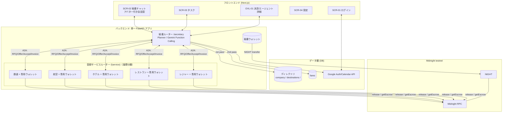

# 基本機能仕様書

> 本デモの全ドキュメントの索引と、**分野横断で「正」となる決定事項（Single Source of Truth）**。各ドキュメントに古い記述が残っていても、本書の決定を優先する。

---

## 0. 前提と割り切り（プロトタイプ範囲）

| 項目 | プロトタイプでの扱い | 備考 |
|---|---|---|
| ネットワーク | **Midnight testnet** |  |
| 多言語対応 | 基本は英語表記。英語/日本語の言語切り替え | MVPは英語だけで開発を想定 |

---

## 1. コンセプト

ユーザーがカレンダーに「5日後 大阪出張」を入れておくだけで、AI秘書が対話で条件を詰めながら以下を自律実行する。

1. カレンダーから「移動が必要な予定」を検知
2. **対話でヒアリング**（日帰り/宿泊、帰着日、観光の希望など）
3. 交通・宿泊・観光・会食を順に **提案 → ユーザーが選択/承認**
4. 各代行AIと A2A で交渉し、door-to-door 時間・予算・優先度で最適化
5. JPYC で各代行AIのウォレットに支払い、代行AIが **オンチェーン着金を確認してから** 予約確定
6. 確定スケジュールをタスクリスト化し、Googleカレンダーへ追加可能

見どころは **AIエージェント同士が市場として振る舞い、決済がオンチェーンで検証される** こと。ただしユーザー体験の主役は「人↔秘書の対話」であり、ブロックチェーン/AI間取引の可視化はオンデマンドの詳細に置く（§11）。

---

## 2. デモシナリオ（大阪出張・宿泊＋観光パターン）

**ユーザープロフィール例:**
- 所在地（出発点）: 東京・五反田（起点最寄り = 品川駅）
- 食事の好み: 中華料理
- 趣味: アート観賞、野球観戦
- ウォレット: 3口座（秘書/交通業者/サービス業者）。JPYC/KAIAはfaucetで準備。秘書へJPYC付与

**フロー:**

| # | 内容 | 秘書AIの動き | ユーザー操作 |
|---|---|---|---|
| 1 | 5日後の大阪出張をカレンダー登録 | 予定を検知し、プラン画面を起動して認識内容を提示 | — |
| 2 | 条件ヒアリング | 「日帰り？宿泊？」「帰りはいつ？」を質問 | 「1泊して、翌日に大阪観光してから帰宅したい」 |
| 3 | 往復交通の提案 | 「品川10:00発 → 大阪13:00着、新幹線14,520円」等（裏で鉄道/航空をdoor-to-door比較） | 承認 |
| 4 | ホテルの提案 | 「ホテルA ☆3.5 / 8,000円」「ホテルB ☆4.3 / 16,000円」 | ホテルB を選択 |
| 5 | 翌日の観光提案（**趣味を反映**） | 「提案1: 大阪美術館 10:00–14:00 → 15:00の新幹線」「提案2: 大阪ドーム野球観戦 13:00–17:00 → 18:00の新幹線」 | 提案2 を選択 |
| 5.5 | （任意）夕食提案（**好み=中華 を反映**） | 中華の候補を提示 | 選択 |
| 6 | サマリー最終確認 | スケジュール全体と合計JPYCを提示 | 承認 |
| 7 | 決済 | 新幹線・ホテル・野球観戦をエスクロー決済（A2A → deposit → release → 予約確定。ガスは売り手負担） | 自動 or 都度承認 |
| 8 | 完了 | タスクリストにスケジュール表示。Googleカレンダー追加可能 | カレンダーに追加 |

---

## 3. システムアーキテクチャ

秘書と各代行AIは **単一 FastAPI プロセス内の別ルーター**。Pinecone namespace を分けて「別事業者のAI」を論理的に表現する。決済は `TravelEscrow` を経由する本物のオンチェーン取引（ウォレットは3口座に集約、`contract-design.md`）。

---

## 4. AIエージェント設計

- **役割:** 予定検知、対話ヒアリング、計画立案、2パス検索、各代行AIの選択、決済指示、旅程組み立て
- **モデル:** Gemini（Flash系中心）
- **実装:** Gemini Function Calling でツール群を呼ぶ

| ツール（function） | 説明 |
|---|---|
| `get_calendar_events(range)` | カレンダーから予定取得 |
| `ask_user(question, options)` | ヒアリング（会話カード生成） |
| `resolve_directory(intent)` | DBアクセス 1回目：company/destinations/ 検索 |
| `lookup_fares(route, cities, modes)` | DBアクセス 2回目：fares（line_haul/access/local/buffer）取得 |
| `normalize_door_to_door(offers, access)` | アクセス・バッファ加算し総所要/総額を算出 |
| `filter_feasible(candidates, constraints)` | 到着・予算のハード制約で除外 |
| `select_option(candidates, priority)` | 優先度スコアで選択＋理由生成 |
| `request_quote(agent_id, intent, fare_rows)` | 代行AIにRFQ（該当fare行を同梱） |
| `pay_invoice(invoice)` | AI秘書ウォレットから送金 |
| `confirm_booking(agent_id, ref_id, tx_hash)` | 着金根拠を渡し予約確定を取得 |
| `build_task_list(bookings)` | 確定予約からタスク/旅程を生成 |

---

## 5. 画面

| ID | 画面 | 備考 |
|---|---|---|
| SCR-01 | ログイン画面 | Googleログイン + Lace wallet接続 |
| SCR-02 | プラン画面。AI秘書とチャット（アバター付き）。中央にチャット画面。右側エリアに手配の進捗を表示する | ヘッダに自分のNIGHT, DUST残高 |
| SCR-03a | タスク画面。確定旅程タブ。タスクリスト。予定の詳細を開く | Googleカレンダー追加 or 開く、過去予定の閲覧 |
| SCR-03b | タスク画面。検知タブ。"Scan"ボタンでGoogleカレンダーから取得。取得した予定から "Ask AI"ボタンでプラン画面を開く。 | 特定ワードを含むタスクを取得する |
| SCR-04a | 設定画面。プロフィール設定 | 氏名、住所、生年月日、居住都道府県。拠点（出発都市・起点）。好み・予算・優先度 |
| SCR-04b | 設定画面。サービス登録 | サービス内容（交通、宿泊、飲食など）、価格、場所、ウォレット |
| SCR-04c | 設定画面。ウォレット設定 | ウォレット接続、自分の残高、デモ用のfaucetなど |
| OVL-01 | 決済・予定詳細 | 口座の残高＋業種内訳、エスクロー中表示、秘匿 or 開示バッジの表示 |
| カード | C1質問/C2提案・承認/C3選択/C4サマリー/C5決済進行/C6完了 | SCR-02の吹き出し内 |

---

## 6. 用語集

| 用語 | 定義 |
|---|---|
| 秘書AI | ヒアリング・計画・交渉駆動・決済指示 |
| ウォレット口座 | ai-secretary:1つだけ/ service-agent:登録サービス毎に存在する |
| Quote/Settle | 見積フェーズ（金銭移動なし）/決済フェーズ（承認後） |
| door-to-door | アクセス＋保安＋現地移動を含む総所要。鉄道⇄航空の比較軸 |
| エスクロー | TravelEscrow。deposit→release/refundで双方向保護 |
| トリアージ | カレンダーのノイズ除去（ルール＋Gemini、確信度high/mid/low） |

---
