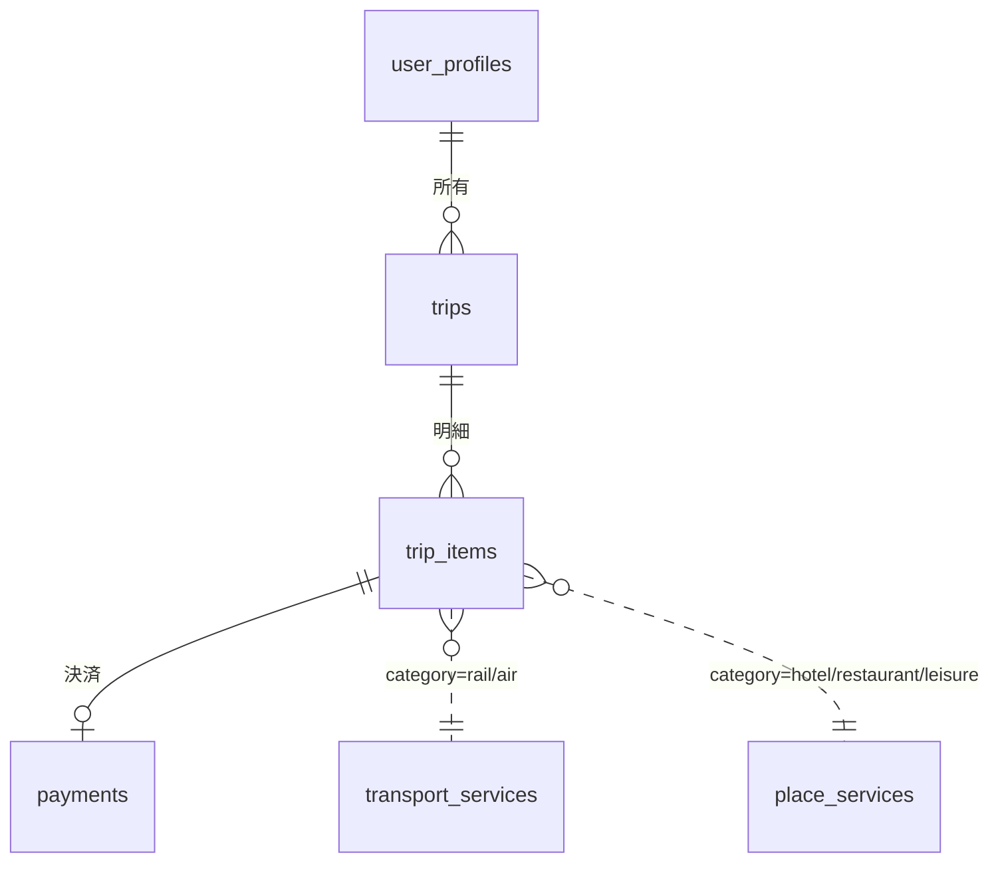

# db-design-mvp.md — MVPデモ向け 簡易DB設計（Neon / PostgreSQL）

> 関連: `basic-spec.md`（SSoT）／`register-page-spec.md`（本書に合わせて改訂済み）／`db-design.puml`（ER図）。

---

## 1. 目的

AI秘書が出張・旅行のプランニングを行うために、**提案の材料（交通・宿泊・飲食・レジャー）**と
**その結果（プロフィール・確定旅程・決済）**を永続化する。

第一版は「提案の材料」だけを設計していたため、**ユーザー・旅程・決済の接続が欠けていた**。
本書はそこを埋め、あわせてサービステーブルの分割粒度を見直すことが主眼である。

さらに、サービスが利用者に要求する**本人属性の検証**（年齢確認・国籍確認・住居確認）を扱う。
バーや成人向けショーのように年齢確認が必要なサービスを、AI秘書が提案の段階で判別できるようにするため（§7.2）。

---

## 2. 確定した前提

| 項目 | 決定 | 理由 |
|---|---|---|
| DBサービス | **Neon（PostgreSQL）** | 第一版から据え置き |
| アクセス経路 | **Next.js から直接**（Route Handlers / Server Components） | 本リポジトリは Next.js のみ。`basic-spec.md` §3 の FastAPI 構成、および第一版 §6 が前提にしていた Python モジュール（`rag/search.py` 等）は存在しない |
| スキーマ管理 | **Drizzle ORM + drizzle-kit** | マイグレーションが SQL ファイルで残りレビューできる。TSの型がスキーマから導かれ、列名の食い違いをビルド時に検出できる |
| 接続 | アプリ = pooled 接続 / マイグレーション = direct 接続 | サーバーレス実行での接続枯渇を避ける（§12） |
| サービステーブルの粒度 | **交通と場所系の2テーブル**（`transport_services` / `place_services`） | 列の一致率が2グループにはっきり分かれる（§4） |
| 利用者 | 単一利用者のデモだが、**テーブルはユーザー単位で持つ** | Googleログインが既に入っており、ユーザー列が無いと後から入れ替えが効かない |
| 在庫管理 | **しない**（据え置き） | 空室・座席・在庫数は扱わない。二重決済は旅程明細の状態で防ぐ（§8） |

---

## 3. 第一版の問題点と本書での解決

| # | 問題 | 影響 | 本書での解決 |
|---|---|---|---|
| 1 | **ユーザー・プロフィールのテーブルが無い** | 第一版 §6 は「出発起点はプロフィール設定から解決」としているが保存先が無い。好み（中華）・趣味（アート／野球）・予算・優先度も永続化できず、デモシナリオ（`basic-spec.md` §2）の手順5・5.5（趣味・好みの反映）が成立しない | `user_profiles` を追加（§6.1） |
| 2 | **旅程テーブルが無いのに `payments.trip_id` がある** | `trip_id` が参照先を持たない孤児列。確定旅程（SCR-03a）・タスクリスト・`build_task_list` の保存先が無い | `trips` / `trip_items` を追加し、`payments` は明細（`trip_item_id`）を参照する（§6.2〜6.4） |
| 3 | **種別コードが2系統あり不一致** | 第一版 §2 は `rail`/`air`/`hotel`/`restaurant`/`leisure`、`payments.service_kind` は `transport`/`dining`/`lodging`/`leisure`。どちらでテーブルを判別するのか決まらない | **`category` の5値1層に統一**し、`service_kind` を廃止（§7） |
| 4 | **`wallet_address` の CHECK が EVM 前提** | 制約は `^0x[0-9a-fA-F]{40}$` だが、`basic-spec.md` のネットワークは **Midnight testnet**（`0x`＋40hex ではない）。このままでは Midnight のアドレスが**全件 CHECK で拒否される** | 正規表現の CHECK を外す。DBは NOT NULL と長さのみを見て、形式検証はアプリ層に置く（§8） |
| 5 | **`register-page-spec.md` が旧設計を前提にしている** | 画面仕様は `vendors` / `inventory_items` / `transit_meta` / `cities` / `city_aliases` / `destinations` を前提にしているが、第一版はそれら全部を「持たない」と明示。参照先の「db-design.md §7 / §10 / §11」も存在しない（第一版は §6 まで） | 画面とテーブルの対応を §11 に置き、`register-page-spec.md` を本書に合わせて改訂した |
| 6 | **アクセス層の記述が実装と乖離** | `basic-spec.md` §3 のアーキ図は単一 FastAPI、第一版 §6 は Python モジュールのシグネチャ据え置きを指示。どちらもこのリポジトリに存在しない | 前提を §2 で確定。読み取り経路を §10 に再定義 |
| 7 | **金額の単位が未定義** | `amount` にオンチェーンの最小単位を入れると integer が溢れ、桁の解釈もコードごとにぶれる | **全テーブル円単位の整数**に統一。最小単位への変換は決済層だけで行い、DBに持ち込まない（§8） |
| 8 | **`origin_access_min` が「拠点」を暗黙に1つへ固定** | 交通行が「五反田→品川=15分」を持つため、プロフィールの住所が変わると行の値と矛盾する | MVPの割り切りとして明文化（§9）。拠点はデモユーザー1人分に固定し、プロフィールの住所は表示と出発都市の解決に使う |
| 9 | **同じサービスへの二重決済を防ぐ仕組みが無い** | 在庫を持たないため、再送・再試行で同一明細に複数の入金が起きうる | 「1明細につき有効な決済は1件」を部分ユニーク制約で担保（§8） |
| 10 | **`updated_at` の更新責任が未定義** | トリガが無いまま更新漏れが起きると、同時編集検知（409）が機能しない | 更新はアプリ層で必ずセットする。トリガを置かない理由も §12 |
| 11 | **種別ごとにテーブルを分けたため共通仕様が4重管理になる** | `wallet_address` の CHECK・`active` による論理削除・`updated_at` の扱い・`price` の制約が4テーブル分。CRUD・API・バリデーションも4系統に分かれる | 場所系3つを `place_services` に統合し、2系統にする（§4） |
| 12 | **全種別を横断する一覧が 4-way UNION になる** | サービス管理画面の「種別＝全て」や予算内候補の抽出が4テーブルの UNION になり、種別を増やすたびに全クエリを直す必要がある | 2テーブル化＋横断用の VIEW（§8） |

---

## 4. サービステーブルを2つにする設計判断

第一版は「種別ごとに必要な項目が違う」ため4テーブルに分けていた。
実際に列を突き合わせると、**違いは種別ごとではなく2グループに分かれていた**。

### 4.1 根拠：列の一致率

`db-design.md` §3 の列から、共通6列（`id` / `code` / `wallet_address` / `active` / `created_at` / `updated_at`）を
除いた固有列で比較した結果。

| 第一版のテーブル | 固有列数 | 他の場所系と一致する列 | 一致率 |
|---|---|---|---|
| `lodging_services` | 11 | 6 | **55%** |
| `dining_services` | 12 | 9 | **75%** |
| `leisure_services` | 10 | 9 | **90%** |
| `transport_services` | 16 | 2（`name` / `price` のみ） | **13%** |

- 場所系3つが共有する6列（`name` / `city` / `address` / `nearest_station` / `station_access_min` / `price`）は
  **3種別すべてで必須**。統合しても NOT NULL を維持できる。
- `genre` / `open_from` / `open_to` は飲食とレジャーで共通。**レジャーの固有列は `age_limit` だけ**で、
  独立したテーブルを持つ根拠がほぼ無い。
- 交通は16列のうち14列が交通固有（2地点・時刻表・door-to-door の内訳）。

### 4.2 根拠：売っているものが違う

列数の偶然ではなく、扱う対象の性質が分かれている。

| | 売るもの | 場所の持ち方 | door-to-door での役割 |
|---|---|---|---|
| **交通** | 2地点間の**移動** | `from_city` / `to_city` ＋ 出発・到着地点 | 区間そのものを提供する |
| **場所系**（宿泊・飲食・レジャー） | 1地点での**消費** | `city` ＋ `nearest_station` ＋ 駅からの時間 | 到着地点からの**追加時間**を提供する |

### 4.3 却下した案

| 案 | 却下理由 |
|---|---|
| **4テーブル維持** | 共通仕様が4重管理（§3-11）、横断一覧が 4-way UNION（§3-12）。レジャーの一致率90%を分けておく利益が無い |
| **共通ヘッダ＋詳細テーブル**（`services` ＋ `transport_details` ＋ `place_details`） | 単一FKが張れる利点はあるが、`trip_items` に確定時点のスナップショットを持たせた時点で**履歴はサービス行に依存しなくなっている**（§6.3）。FKの価値が減っている一方、書き込みが常に2テーブル＋トランザクションになる。横断一覧は VIEW で得られる |
| **1テーブルへ完全統合** | 交通の一致率が13%しかない。`city` と `from_city`/`to_city` で「都市」の解釈が2通りになり、door-to-door の式が行の形で分岐する。第一版の「1行で計算が完結する」性質が濁る |
| **場所系をさらに分割**（宿泊だけ別） | 宿泊も55%一致。固有列5つのためにテーブルを増やす価値が無い |

### 4.4 統合を検討してやめたもの

| 検討 | 判断 | 理由 |
|---|---|---|
| `checkin_from` / `checkout_by` を `open_from` / `open_to` に統合 | **やめる** | チェックイン15:00 → チェックアウト10:00 は翌日なので、`CHECK (open_from < open_to)` に**必ず違反する**。2列削るために制約を捨てる価値は無い |
| 種別固有の列を `jsonb` に寄せる | **やめる** | `genre`・`rating`・`open_*`・`has_alcohol`・`age_limit` は検索・並べ替え・将来の年齢認証で**ロジックが読む列**。jsonb にすると型も CHECK も失い、`register-page-spec.md` の旧設計（`attrs`）に戻ることになる |
| `transport_services` も統合 | **やめる** | 一致率13%（§4.1） |

### 4.5 統合で変わる「守り方」

種別固有の列は NULL 可になるが、**その種別で使わない列に値が入らないことを CHECK で縛る**（§8）。
「テーブルの型で守る」から「CHECK で守る」に変わるだけで強度は同等であり、
代わりに CRUD・API・バリデーションが4系統から2系統に減る。

なお第一版は「種別はコードの固定値でDBに置かない唯一のもの」としていたが、
本書では**種別をテーブル名ではなく列（`mode` / `kind`）で持つ**。
表示名・色・アイコンは引き続きコード側に置く（§7）。

---

## 5. テーブル構成

```
DB（Neon）
├─ user_profiles       ユーザーと設定
├─ trips               旅程ヘッダ
├─ trip_items          旅程明細＝確定した予約
├─ payments            決済台帳（エスクロー用）
├─ transport_services  交通手段（鉄道・航空）
└─ place_services      場所で消費するサービス（宿泊・飲食・レジャー）

導出（テーブルを増やさない）
├─ service_catalog     全種別の横断一覧 VIEW（§8）
└─ 手配可能な都市      transport_services の有効行の到着都市（§10）

コードの固定値
├─ category 5値       表示名・色・アイコン・対応テーブル（§7.1）
└─ verification 3値   要求できる本人属性の検証の種類（§7.2）
```



上3テーブル間は**外部キーあり**。サービステーブルへの参照は**論理参照**（`category` で参照先が
2つに分岐するため外部キー制約を張れない）。サービステーブル同士に関連は無い（事業者マスタを持たないため）。

---

## 6. テーブル定義

全テーブル共通: `created_at` / `updated_at`（timestamptz・NOT NULL）。
時刻を持つ列は **timestamptz**、日付だけの列は **date**、営業時間などの時刻だけの列は **time** を使う。

### 6.1 `user_profiles` — ユーザーと設定

対応画面: SCR-04a（プロフィール設定）、SCR-04c（ウォレット設定）。

| カラム | 型 | 必須 | 説明 |
|---|---|---|---|
| `user_id` | text PK | ✓ | **Google アカウントの `sub`**。NextAuth は JWT 戦略でDBアダプタを持たないため、外部IDをそのまま主キーにする |
| `email` | text UNIQUE | ✓ | 突合・表示用 |
| `full_name` | text | – | 氏名 |
| `address` | text | – | 住所（表示用。移動時間の算出にも述語判定にも使わない → §9） |
| `birth_date` | date | – | 生年月日。**年齢確認（`age`）の述語の元**（§7.2） |
| `nationality` | text | – | 国籍（ISO 3166-1 alpha-2、`JP`）。**国籍確認（`nationality`）の述語の元** |
| `residence_pref` | text | – | 居住都道府県（「大阪府」）。**住居確認（`residence`）の述語の元** |
| `home_city` | text | ✓ | **拠点都市**（「東京」）。交通検索の `from_city` になる |
| `home_spot` | text | – | 起点最寄り（「品川」）。候補の絞り込みと表示に使う |
| `dining_genres` | text[] | – | 食事の好み（`{中華}`）。`place_services.genre` と突き合わせる |
| `leisure_genres` | text[] | – | 趣味（`{art,baseball}`）。同上 |
| `budget` | integer | – | 1旅程あたりの上限。`filter_feasible` のハード制約に使う |
| `priority` | text | – | `time` / `price` / `comfort`（コード固定値）。`select_option` のスコア重みを決める |
| `wallet_address` | text | – | **秘書ウォレット＝支払元**。サービス側の `wallet_address`（送金先）とは役割が逆 |

**好み・趣味を子テーブルにしない理由**: 値は数個で、検索は「サービス行の `genre` と一致するか」だけ。
配列の重なり判定で足り、子テーブルと結合を増やす利益が無い。

**`nationality` / `residence_pref` を `address` と別に持つ理由**: `address` は自由入力のため
述語の判定に使えない。既存の `address`（表示用）と `home_city`（処理用）の役割分担と同じで、
**検証に使う粒度の列を分けて持つ**（§7.2）。

### 6.2 `trips` — 旅程ヘッダ

対応画面: SCR-03a（確定旅程タブ）、SCR-03b（検知タブ）、SCR-02（プラン画面の対象）。

| カラム | 型 | 必須 | 説明 |
|---|---|---|---|
| `id` | uuid PK | ✓ | |
| `user_id` | text FK→`user_profiles` | ✓ | |
| `title` | text | ✓ | 「大阪出張」（カレンダー予定の件名由来） |
| `origin_city` / `destination_city` | text | ✓ | 出発都市 / 目的都市。`origin_city` はプロフィールのスナップショット |
| `start_date` | date | ✓ | 出発日 |
| `end_date` | date | – | 帰着日。**未設定＝ヒアリング前**、`end_date > start_date` で宿泊を伴うことを表す（日帰り／宿泊のフラグを別に持たない） |
| `status` | text | ✓ | `detected` → `planning` → `confirmed` → `completed`（異常系: `cancelled`） |
| `source_event_id` | text | – | Google Calendar の event id。**再スキャン時の重複作成を防ぐ**ためにユニーク制約を張る（§8） |
| `detection_confidence` | text | – | `high` / `mid` / `low`（`basic-spec.md` §6 のトリアージ結果） |

合計金額は列に持たず、`trip_items` の合計で導出する（明細と合計がずれる状態を作らないため）。

### 6.3 `trip_items` — 旅程明細

「確定した1件の予約」。タスクリストの1行、決済の1単位、カレンダー登録の1イベントが
すべてこの粒度で対応する。

| カラム | 型 | 必須 | 説明 |
|---|---|---|---|
| `id` | uuid PK | ✓ | |
| `trip_id` | uuid FK→`trips`（ON DELETE CASCADE） | ✓ | |
| `seq` | integer | ✓ | 旅程内の並び順。`(trip_id, seq)` はユニーク |
| `category` | text | ✓ | `rail` / `air` / `hotel` / `restaurant` / `leisure`。**参照先テーブルもこの値から決まる**（§7） |
| `service_id` | uuid | ✓ | 対象サービス行の id（論理参照） |
| `name_snapshot` | text | ✓ | 確定時点の名称 |
| `unit_price` | integer | ✓ | 確定時点の単価（1泊 / 1人 / 1枚 / 片道） |
| `quantity` | integer | ✓ | 泊数・人数・枚数。既定 1 |
| `price` | integer | ✓ | 確定額（= `unit_price` × `quantity`）。決済と合計はこの列だけを見る |
| `payee_snapshot` | text | ✓ | 確定時点の送金先アドレス |
| `start_at` / `end_at` | timestamptz | – | 旅程上の日時。タスク表示とカレンダー登録に使う |
| `status` | text | ✓ | `selected` → `paid` → `booked`（異常系: `cancelled`） |
| `booking_ref` | text | – | 売り手が発行した予約番号 |
| `google_event_id` | text | – | カレンダー追加済みの識別。**重複追加を防ぐ** |

**スナップショット列を持つ理由**: サービス行は画面から編集・無効化できる（`active=false`）。
確定した旅程が後の編集で書き換わると、過去の旅程と決済履歴が嘘になる。
第一版が `payments.payee` をスナップショットにしたのと**同じ理由を明細にも適用**した。
この設計により、**履歴の表示はサービス行を参照しなくても成立する**（§4.3 で共通ヘッダ案を却下した根拠）。

### 6.4 `payments` — 決済台帳

エスクローは「預ける → 解放する」の2段階で解放が後から行われるため、
どの決済が未解放かをサーバ再起動後も追える台帳が必要（第一版 §3.5 の趣旨は据え置き）。

| カラム | 型 | 必須 | 変更 | 説明 |
|---|---|---|---|---|
| `ref_id` | text PK | ✓ | 据え置き | 決済の冪等キー（コントラクトの `refId` の元） |
| `trip_item_id` | uuid FK→`trip_items` | ✓ | **★追加** | 決済対象の明細 |
| `payee` | text | ✓ | 据え置き | 送金先アドレスのスナップショット |
| `amount` | integer | ✓ | 据え置き | 金額（円単位・§8） |
| `expiry` | timestamptz | ✓ | 据え置き | 返金可能になる時刻 |
| `status` | text | ✓ | 据え置き | `deposited` / `released` / `refunded` / `failed` |
| `deposit_tx` / `release_tx` / `refund_tx` | text | – | 据え置き | 各トランザクションハッシュ |
| `trip_id` | — | — | **削除** | 参照先の無い孤児列だった。`trip_items` 経由で辿れる |
| `service_kind` / `service_id` | — | — | **削除** | `trip_items` が同じ情報とスナップショットを持つため重複していた |

### 6.5 `transport_services` — 交通手段（鉄道・航空）

第一版 §3.1 から列は変更していない（`wallet_address` の CHECK のみ §8 で変更）。
鉄道と航空は列が完全に一致するため、`mode` で区別して1テーブルに置く。

| カラム | 型 | 必須 | 説明 |
|---|---|---|---|
| `id` | uuid PK | ✓ | |
| `code` | text UNIQUE | ✓ | 安定ID。`agent_id` としても使う（§10） |
| `name` | text | ✓ | 名称（「JR東海道新幹線 のぞみ221号」「ANA 017便」） |
| `mode` | text | ✓ | `rail` / `air`。**そのまま `category` になる**（§7） |
| `from_city` / `to_city` | text | ✓ | 出発都市 / 到着都市（「東京」「大阪」） |
| `from_spot` / `to_spot` | text | ✓ | 出発地点 / 到着地点（「品川」「新大阪」「HND」「ITM」） |
| `depart_time` / `arrive_time` | time | – | 出発時刻 / 到着時刻 |
| `duration_min` | integer | ✓ | 移動時間（乗車・搭乗のみ。待ち時間は含めない） |
| `price` | integer | ✓ | 運賃（片道あたり） |
| `origin_access_min` | integer | ✓ | **拠点→出発地点**（五反田→品川=15、→羽田=50） |
| `boarding_buffer_min` | integer | ✓ | **乗車・搭乗前**の待ち（鉄道=10、航空=60） |
| `arrival_buffer_min` | integer | – | **降車・降機後**（航空の荷物受取=20、鉄道=0） |
| `destination_access_min` | integer | ✓ | **到着地点→市内目的地**（新大阪→梅田=15、伊丹→梅田=30） |
| `access_fare` | integer | – | 前後アクセスの運賃合計（鉄道=490、航空=1350） |
| `seat_class` | text | – | 席種（指定席） |
| `wallet_address` | text | ✓ | 送金先 |
| `active` | boolean | ✓ | 論理削除 |

### 6.6 `place_services` — 場所で消費するサービス（宿泊・飲食・レジャー）

第一版の `lodging_services` / `dining_services` / `leisure_services` を統合したテーブル（§4）。

**共通列（3種別すべてで必須）**

| カラム | 型 | 説明 |
|---|---|---|
| `id` | uuid PK | |
| `code` | text UNIQUE | 安定ID。`agent_id` としても使う（§10） |
| `kind` | text | `hotel` / `restaurant` / `leisure`。**そのまま `category` になる**（§7） |
| `name` | text | 施設・店舗・イベント名 |
| `city` | text | 都市（「大阪」） |
| `address` | text | 住所 |
| `nearest_station` | text | 最寄り駅（「新大阪駅」） |
| `station_access_min` | integer | **最寄り駅からの時間**。到着地点からの追加時間として door-to-door に加算する（§9） |
| `price` | integer | 価格。単位は `kind` から導出（1泊 / 1人 / 1枚） |
| `required_verifications` | text[] | **要求する本人属性の検証**（`age` / `nationality` / `residence`・§7.2）。既定 `{}`（検証不要）。**NOT NULL** にして「不要」を NULL と空配列の2通りで表さない |
| `wallet_address` | text | 送金先 |
| `active` | boolean | 論理削除 |

**種別依存の列**（✓必須 ／ –任意 ／ ×その種別では使わない＝NULL固定）

| カラム | 型 | `hotel` | `restaurant` | `leisure` | 説明 |
|---|---|---|---|---|---|
| `item_name` | text | – | ✓ | × | プラン名（「シングル 朝食付」）／ 商品名・コース名（「ディナーコース」）。第一版の `plan_name` と `item_name` を統合 |
| `genre` | text | × | ✓ | ✓ | 中華・和食 ／ `art`・`baseball`。**好み・趣味の反映に使う**（自由入力） |
| `open_from` / `open_to` | time | × | – | – | 営業時間 ／ 開催・開館時間。旅程の時刻と所要の算出に使う |
| `checkin_from` / `checkout_by` | time | – | × | × | チェックイン・チェックアウト。**`open_*` と統合しない**（§4.4） |
| `rating` | numeric(2,1) | – | × | × | 評価（0.0〜5.0）。**最高評価が提案の「おすすめ」になる** |
| `breakfast_included` | boolean | – | × | × | 朝食の有無 |
| `has_alcohol` | boolean | × | ✓ | × | アルコール提供の有無（既定 false）。**`required_verifications` とは独立**（§7.2） |
| `seats` | text | × | – | × | 個室・カウンターなどの補足（自由記述） |
| `age_limit` | integer | – | – | – | 年齢のしきい値（18 / 20）。**`age` を要求する場合のみ必須**で、要求しない場合は NULL（§8）。3種別すべてで使える |

「×」は CHECK で NULL を強制する（§8）。これにより統合しても NULL が無秩序に散らない。

**`age_limit` を3種別すべてで使える列にした理由**: 第一版はレジャー専用の列だったが、
バーのような飲食店にも年齢制限が必要になった（§7.2）。種別で制限するのをやめ、
代わりに **`required_verifications` に `age` を含むかどうかと双方向で一致させる**（§8）。
これにより「年齢確認を要求するのにしきい値が無い」「しきい値があるのに確認を要求しない」の
両方をDBが拒否する。

**`code` の一意性**: 各テーブル内で UNIQUE。`transport_services` と `place_services` の間では
DBが重複を防げないため、**種別を接頭辞にする命名規約**で衝突を避ける（`rail-nozomi-221` / `hotel-osaka-b`）。

---

## 7. コードの固定値

### 7.1 種別コード（`category` の1層に統一）

第一版は1つの概念に2系統の値を持っていた（§3-3）。本書は **`category` の5値だけ**にする。

| `category` | 表示名 | 参照するテーブル | 判別条件 | 価格の単位 |
|---|---|---|---|---|
| `rail` | 鉄道 | `transport_services` | `mode='rail'` | 片道 |
| `air` | 航空 | `transport_services` | `mode='air'` | 片道 |
| `hotel` | 宿泊 | `place_services` | `kind='hotel'` | 1泊 |
| `restaurant` | 飲食 | `place_services` | `kind='restaurant'` | 1人 |
| `leisure` | レジャー | `place_services` | `kind='leisure'` | 1枚 |

- `trip_items` は `category` **1列だけ**を持ち、参照先テーブルもこの値から決まる（`service_kind` は廃止）。
- サービス側の `mode` / `kind` は**そのまま `category` の値**になる。導出のための変換表を持たない。
- 表示名・色・アイコン・価格の単位はコード側に置く。**種別を増やすときだけコード変更が必要**という
  第一版の性質は維持される（スキーマ変更は不要で、`kind` の CHECK と画面の切り替えを追加する）。

### 7.2 認証種別（`verification` の3値）

サービスが利用者に要求する**本人属性の検証**の種類。`category` と同じくコード側の固定値とし、
サービス行は要求する種類を `required_verifications`（text[]）で持つ（§6.6）。

| `verification` | 表示名 | 検証する属性 | 述語の元になる列 | 用例 |
|---|---|---|---|---|
| `age` | 年齢確認 | 生年月日から導く年齢 | `user_profiles.birth_date` ＋ サービスの `age_limit` | バー・成人向けショー・酒類提供店 |
| `nationality` | 国籍確認 | 国籍 | `user_profiles.nationality` | 訪日外国人限定プラン・免税対応 |
| `residence` | 住居確認 | 居住地（都道府県） | `user_profiles.residence_pref` | 大阪府民割引・地元住民限定料金 |

**設計の考え方**

- サービス側は「**どの属性の証明を要求するか**」だけを宣言する。値そのものを受け取る前提を置かない。
  Midnight を使う本デモでは、利用者は属性値を開示せずに述語（20歳以上である／大阪府在住である）の
  証明だけを提示できるため、DBに「要求する種類」を持てば足りる。
- **`age` だけが機械判定できるしきい値を持つ**（`age_limit`）。`nationality` / `residence` の具体的な
  述語（どの国籍か・どの都道府県か）は MVP では列に持たず、`item_name` などの人間可読な名称で表す
  （「訪日外国人限定プラン」「大阪府民割引プラン」）。§14-4 で扱う。
- 種類を増やすときは、この表・`required_verifications` の CHECK・画面の入力欄を同時に更新する（§14-3）。

**`has_alcohol` と `required_verifications` を分けて持つ理由**

この2つは**独立した事実**であり、一方から他方を導出できない。

| 例 | `has_alcohol` | `required_verifications` | 理由 |
|---|---|---|---|
| 中華料理店（ビールあり） | `true` | `{}` | 入店に年齢確認は不要。提供時に店員が判断する |
| バー・立ち飲み居酒屋 | `true` | `{age}` | 入店自体が20歳以上に限られる |
| 成人向けショー（酒類なし） | `null`（レジャー） | `{age}` | 酒類とは無関係に年齢制限がある |
| カフェ | `false` | `{}` | |

`has_alcohol` は「アルコールを提供するかどうか」の事実（飲食のみ）、
`required_verifications` は「利用に検証を要求するかどうか」の運用である。

---

## 8. 制約・インデックス・横断VIEW

**制約**

```sql
-- 金額・数量（全テーブル共通）
CHECK (price >= 0)
CHECK (quantity >= 1)

-- 送金先は形式を DB で縛らない（Midnight / EVM でアドレス形式が異なるため）
CHECK (length(wallet_address) BETWEEN 8 AND 200)

-- 値域
CHECK (mode IN ('rail','air'))                                                -- transport_services
CHECK (kind IN ('hotel','restaurant','leisure'))                              -- place_services
CHECK (category IN ('rail','air','hotel','restaurant','leisure'))             -- trip_items
CHECK (status IN ('detected','planning','confirmed','completed','cancelled')) -- trips
CHECK (status IN ('selected','paid','booked','cancelled'))                    -- trip_items
CHECK (status IN ('deposited','released','refunded','failed'))                -- payments
CHECK (priority IN ('time','price','comfort'))                                -- user_profiles
CHECK (end_date IS NULL OR end_date >= start_date)                            -- trips

-- place_services: 種別ごとの必須（§6.6 の ✓）
CHECK (kind = 'hotel' OR genre IS NOT NULL)                    -- 飲食・レジャーは genre 必須
CHECK (kind <> 'restaurant' OR (item_name IS NOT NULL AND has_alcohol IS NOT NULL))

-- place_services: 種別ごとに「使わない列」を NULL に固定する（§6.6 の ×）。種別ごとに1本ずつ置く
CHECK (kind <> 'hotel' OR (genre IS NULL AND open_from IS NULL AND open_to IS NULL
                           AND has_alcohol IS NULL AND seats IS NULL))
CHECK (kind <> 'restaurant' OR (checkin_from IS NULL AND checkout_by IS NULL
                                AND rating IS NULL AND breakfast_included IS NULL))
CHECK (kind <> 'leisure' OR (item_name IS NULL AND checkin_from IS NULL AND checkout_by IS NULL
                             AND rating IS NULL AND breakfast_included IS NULL
                             AND has_alcohol IS NULL AND seats IS NULL))

-- place_services: 認証種別（§7.2）
--   要素はコードの固定値3つに限る（配列の包含で縛る）
CHECK (required_verifications <@ ARRAY['age','nationality','residence']::text[])
--   age を要求するなら age_limit が必須。age_limit があるなら age を要求している（双方向で一致）
CHECK (('age' = ANY(required_verifications)) = (age_limit IS NOT NULL))
CHECK (age_limit IS NULL OR age_limit BETWEEN 0 AND 120)

-- 営業時間の整合。宿泊は open_* を使わない（NULL固定）ため、
-- チェックイン15:00→チェックアウト翌10:00 がこの制約に触れることはない（§4.4）
CHECK (open_from IS NULL OR open_to IS NULL OR open_from < open_to)

-- 同じカレンダー予定から旅程を二重に作らない（再スキャン対策）
CREATE UNIQUE INDEX ON trips (user_id, source_event_id) WHERE source_event_id IS NOT NULL;

-- 1明細につき有効な決済は1件だけ（再試行は failed にしてから新しい ref_id で行う）
CREATE UNIQUE INDEX ON payments (trip_item_id) WHERE status <> 'failed';
```

**アドレス形式を DB で縛らない判断**: 第一版の `^0x[0-9a-fA-F]{40}$` は EVM 系の形式で、
`basic-spec.md` が指定する Midnight testnet のアドレスは通らない。
ネットワークが変わるたびに制約とマイグレーションを書き換えるのは割に合わないため、
**形式検証はアプリ層（保存前のバリデーション）に置き、DBは長さと NOT NULL だけを見る**。

**金額の単位**: 金額の列（`price` / `unit_price` / `access_fare` / `amount` / `budget`）はすべて
**デモトークン MST 建ての整数**（1 MST = 1 円相当）。オンチェーンの最小単位への変換は決済層だけで行い、
DBには持ち込まない（integer に最小単位を入れると桁が溢れる）。
**列名には通貨を入れない**（通貨が変わっても列名を変えずに済むようにするため）。

**インデックス**

| テーブル | インデックス | 用途 |
|---|---|---|
| `transport_services` | `(from_city, to_city, active)` | 経路検索 |
| `transport_services` | `(to_city) WHERE active` | 手配可能な都市の導出 |
| `place_services` | `(kind, city, active)` | 都市での候補検索 |
| `place_services` | `(kind, city, genre, active)` | 好み・趣味の反映 |
| `trips` | `(user_id, start_date DESC)` | タスク画面の一覧・過去予定の閲覧 |
| `trip_items` | `(trip_id, seq)` | 旅程の表示順 |
| `payments` | `(status)` | 未解放の決済の洗い出し |

**横断一覧の VIEW**

サービス管理画面の「種別＝全て」や予算内候補の抽出のために、2テーブルを1本で読めるようにする。
`mode` と `kind` がそのまま `category` になるため、変換を挟まずに UNION できる。

```sql
CREATE VIEW service_catalog AS
  SELECT id, mode AS category, code, name, price,
         from_spot || ' → ' || to_spot AS location,
         wallet_address, active, updated_at
    FROM transport_services
  UNION ALL
  SELECT id, kind AS category, code, name, price,
         city AS location,
         wallet_address, active, updated_at
    FROM place_services;
```

一覧・検索・種別フィルタはこの VIEW を読む。詳細の取得と更新は `category` から実テーブルを決めて行う。

---

## 9. door-to-door と「拠点」の割り切り

算出式は第一版 §4 から変更しない（交通1行で完結する）。

```
所要 = origin_access_min + boarding_buffer_min + duration_min
       + arrival_buffer_min + destination_access_min
総額 = price + access_fare
```

検算値も据え置き（鉄道 **187分 / 15,010**、航空 **235分 / 14,350**）。

**場所系サービスへの到着**: 交通で到着地点まで着いた後、`place_services.station_access_min`
（最寄り駅からの時間）を足す。「新大阪駅から15分」から目的地までの時間を出せる。

**明文化する割り切り**: `origin_access_min`（拠点→出発地点）は交通行が持つため、
**行の値はデモユーザーの拠点1点を前提としている**。
プロフィールの `address` は表示用で、移動時間の算出には使わない。
`home_city` は**交通検索の `from_city` を決めるためだけ**に使う。

この前提を崩す（拠点ごとにアクセス時間を変える）には、第一版が意図的に廃した
`transit_meta` 相当を復活させる必要がある。MVPの範囲では行わない。

---

## 10. 読み取り・書き込み経路

AI秘書のツール（`basic-spec.md` §4）と DB の対応。秘書は Next.js と同一プロセスで動くため、
**内部利用は HTTP を経由せずサーバ関数を直接呼ぶ**。HTTP API は画面が使う分だけ用意する。

| 秘書のツール | DBアクセス |
|---|---|
| `resolve_directory(intent)` | `user_profiles`（拠点・好み・趣味・予算）＋ 目的都市は予定の件名テキストから解決 |
| `lookup_fares(route, ...)` | `transport_services` を `from_city` / `to_city` / `active` で取得し、内訳列から door-to-door を合成 |
| （サービス候補の取得） | `place_services` を `kind` ＋ `city` ＋ `genre` で取得 |
| `filter_feasible` | `place_services.required_verifications` を読み、**検証を満たせない候補を除外する**（`age` は `birth_date` と `age_limit`、`nationality` は `nationality`、`residence` は `residence_pref` で判定・§7.2）。判定と経路は実装済みだが、**現バージョンは除外を無効にし、満たせるかの判断も AI に委ねている**（`profile-page-spec.md` §15）。`budget` も画面の上限価格と単位が違う（1旅程 / 1泊）ため、ハード制約ではなく AI への指示として渡している |
| `select_option` | `user_profiles.priority` で重み付け。好みのジャンル（`dining_genres` / `leisure_genres`）に合う候補を前に出す。**提案経路に実装済み**（`profile-page-spec.md` §15）。宿泊は `rating` 最大を「おすすめ」にする |
| `pay_invoice` / `confirm_booking` | `payments` の作成と状態遷移、`trip_items.status` / `booking_ref` の更新 |
| `build_task_list(bookings)` | `trips` / `trip_items` を書き込み、`trips.status` を `confirmed` にする |

**売り手の合成**（事業者テーブルが無いため・第一版 §6 から据え置き）

| 提案・交渉で使う値 | 生成元 |
|---|---|
| `agent_id`（スレッド識別・表示） | サービスの `code` |
| 表示名・アバター | `name` ＋ `category` の固定色・アイコン（§7） |
| 請求先（`payee`） | `wallet_address` |
| 価格 | `price` |

**HTTP API（画面用）**

すべて認証必須（既存の `requireSession()` 配下）。ユーザー単位のデータは**セッションの `user_id` で絞る**。
サービスの更新系は**交通と場所系の2系統**（第一版の想定では4系統だった）。

| 用途 | エンドポイント |
|---|---|
| プロフィール更新 | `PUT /api/profile`（取得は画面がサーバ関数を直接呼ぶため `GET` は未実装・`profile-page-spec.md` §6.5） |
| サービス横断一覧 | `GET /api/services?category=&city=&q=&active=`（`service_catalog` を読む） |
| 交通の詳細・登録・更新・無効化 | `GET` / `POST /api/services/transport` ／ `PUT` / `DELETE /api/services/transport/{id}` |
| 場所系の詳細・登録・更新・無効化 | `GET` / `POST /api/services/place` ／ `PUT` / `DELETE /api/services/place/{id}` |
| 手配可能な都市 | `GET /api/cities/supported` |
| 旅程一覧・詳細 | `GET /api/trips` ／ `GET /api/trips/{id}` |
| 旅程の作成・更新 | `POST /api/trips` ／ `PUT /api/trips/{id}` |
| 決済台帳 | `POST /api/payments`（deposit）／ `PUT /api/payments/{refId}`（release / refund） |

**手配可能な都市**は第一版の方針どおりフラグを持たず、`transport_services` の有効行の
到着都市を重複排除して導出する。

---

## 11. 画面とテーブルの対応

| 画面 | 主に読む・書くテーブル |
|---|---|
| SCR-02 プラン画面 | 読: `transport_services`・`place_services`・`user_profiles` ／ 書: `trips`・`trip_items`・`payments` |
| SCR-03a タスク（確定旅程） | 読: `trips`・`trip_items` ／ 書: `trip_items.google_event_id` |
| SCR-03b タスク（検知） | 書: `trips`（`status='detected'`・`source_event_id`） |
| SCR-04a プロフィール設定 | `user_profiles`（氏名・住所・生年月日・**居住都道府県**・拠点・好み・予算・優先度・**ウォレットアドレス**（暫定））。国籍は MVP では入力欄を持たない |
| SCR-04b サービス管理 | 一覧: `service_catalog` ／ 詳細・更新: `transport_services`・`place_services`（**認証要求の入力を含む**・`register-page-spec.md`） |
| SCR-04c ウォレット設定 | `user_profiles.wallet_address`（残高はチェーン照会でDBに持たない）。**画面が未着手のため、アドレスの入力は暫定で SCR-04a が持つ**（`profile-page-spec.md` §4.6） |
| OVL-01 決済・予定詳細 | `payments`・`trip_items` |

`basic-spec.md` §5 は「SCR-04b 設定画面.サービス登録」、旧 `register-page-spec.md` は「SCR-05 `/services`」と
**同じ画面に別のIDを与えていた**。SSoT である `basic-spec.md` 側の **SCR-04b** に統一した。

---

## 12. マイグレーション運用

| 論点 | 方針 | 理由 |
|---|---|---|
| 接続文字列 | `DATABASE_URL`（pooled）をアプリ、`DATABASE_URL_UNPOOLED`（direct）を drizzle-kit が使う | pooled 接続ではセッション単位の DDL が安定しない |
| uuid の生成 | DB側の `gen_random_uuid()` を既定値にする | PostgreSQL 13 以降の標準機能で拡張が不要。アプリ側で採番しないため再送でも重複しない |
| `updated_at` | **アプリ層で必ずセット**（トリガを置かない） | 同時編集検知（取得時の `updated_at` を送り、不一致なら409）はアプリが値を制御している方が追跡しやすい。トリガとアプリの二重更新は原因の切り分けが難しくなる |
| 論理削除 | サービス2テーブルは `active=false`。`trips` / `trip_items` は `status='cancelled'` | 過去の旅程が参照している行を壊さない。状態を持つものにフラグを増やさない |
| VIEW の管理 | `service_catalog` もマイグレーションで管理する（`CREATE OR REPLACE VIEW`） | 列を追加したときに VIEW の更新漏れが起きないようにする |
| シードデータ | `basic-spec.md` §2 のデモシナリオ一式を投入し、§9 の検算値と一致することを確認する | 「値が入っている」ではなく「door-to-door が仕様どおり出る」を合格条件にする |
| 第一版からのデータ移行 | **不要**（実装前）。`db-design.md` §5 の JSON からの投入先が `place_services` に変わるだけ | |

---

## 13. 他ドキュメントへの反映

| 対象 | 状態 |
|---|---|
| `db-design.md` | **本書で置き換える**。第一版で定義していたサービステーブルの列は §6.5 / §6.6 に移した（本書は自己完結している） |
| `db-design.puml` | **`db-design2.puml` が正**。第一版の図は4テーブル構成のまま残っている |
| `register-page-spec.md` | **本書に合わせて改訂済み**（SCR-04b・2テーブル構成。旧仕様からのラベル変更は同書 §16 に列挙） |
| `basic-spec.md` §3 | 未反映。アーキ図のバックエンドを「単一 FastAPI」から実装（Next.js）に合わせる。データ層の `directory` / `fares` も本書のテーブル名にする |
| `basic-spec.md` §5 | 未反映。SCR-04b の説明を「サービス登録」から「サービス管理」に揃える（画面IDは SCR-04b のまま） |
| `src/auth.ts` | **反映済み**。session コールバックで JWT の `sub` をセッションに載せ、`user_profiles.user_id` に使えるようにした（`profile-page-spec.md` §6.1） |

---

## 14. 未解決の論点

| # | 論点 | 補足 |
|---|---|---|
| 1 | ~~**通貨・ネットワークの記述が混在**~~ **決着済み** | 決済額は**デモトークン MST**（`token.compact` が発行、1 MST = 1 円相当）。ネイティブトークンの NIGHT とガス資源の DUST はそのまま。金額の列名からは通貨を外した（§8）ので、通貨が変わっても列名は動かない。アドレス形式を DB で縛らない判断（§8）も据え置き |
| 2 | 秘書ウォレットの秘密鍵 | DBには**持たない**。`user_profiles.wallet_address` は公開アドレスのみ。署名の置き場所は別途決める |
| 3 | 場所系に種別・認証種別を追加するときの運用 | スキーマ変更は不要だが、`kind` の CHECK・種別依存列の CHECK・`required_verifications` の CHECK・画面の切り替えを同時に更新する必要がある（§7）。CHECK が種別数に比例して増えるため、5〜6種別を超える規模になったら `jsonb` か詳細テーブルへの分離を再検討する |
| 4 | **`nationality` / `residence` の述語のパラメータ** | `age` は `age_limit` でしきい値を持つが、他の2つは「どの国籍か」「どの都道府県か」を列に持っていない（§7.2）。MVPは `item_name` の名称で表す。複数の条件を機械判定する必要が出たら、`required_verifications` を text[] から `jsonb`（種類＋パラメータの配列）に変えるか、子テーブルに分ける |
| 5 | **検証の結果を旅程に残すか** | `trip_items` は現在「何を予約したか」だけを持ち、「どの検証を提示したか」を持たない。OVL-01 の秘匿／開示バッジを履歴として表示するなら、`trip_items` に提示した検証の種類（と証明の参照）を持たせる必要がある。**本書では未対応** |
| 6 | Midnight の証明との接続 | §7.2 は「どの属性の証明を要求するか」までを決めている。実際の証明の生成・検証の置き場所（コントラクト／クライアント）は別途設計する |
| 7 | サービス名の多言語 | MVPは英語のみのため名称は1列。en/ja を持つなら列追加ではなく別テーブルが妥当（後続） |
| 8 | 残高の保持 | 残高はチェーン照会でDBに持たない前提。表示の遅さが問題になる場合のみキャッシュを検討 |
| 9 | 複数ユーザーの扱い | ユーザー単位で設計したが、サービス2テーブルは**全ユーザー共通の在庫**として扱う（誰が登録したかを持たない）。出品者を分けるなら列追加が必要 |

---
