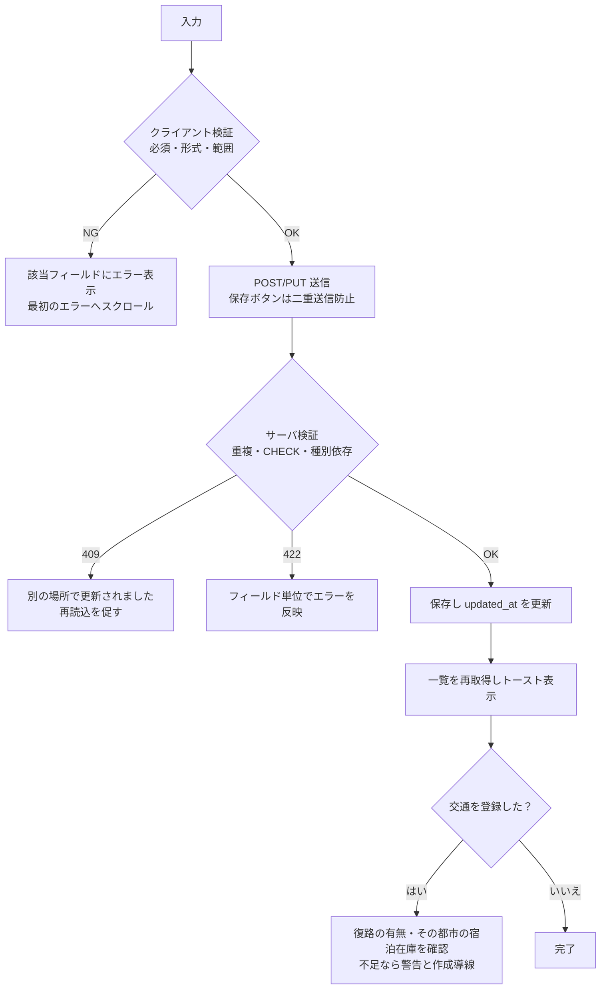

# register-page-spec.md — サービス管理画面（SCR-04b）設計書

> 関連: データ設計は `db-design2.md`（テーブル・列・制約・API）。画面一覧は `basic-spec.md` §5。
>
> 目的: 交通・宿泊・飲食・レジャーのサービスを、**コード変更なしに画面から登録・編集・無効化**できるようにする。
> 登録した内容はそのまま AI 秘書の提案対象になる。

**本書は `db-design2.md`（2テーブル構成）に合わせた改訂版**である。
旧版は `vendors` / `inventory_items` / `transit_meta` / `cities` / `city_aliases` / `destinations` を
前提にしていたが、これらのテーブルは存在しない。旧版からのラベル・項目の変更は §16 に列挙する。

---

## 1. スコープ

| 対象 | 対応テーブル（`db-design2.md`） |
|---|---|
| 交通手段（鉄道・航空）の登録・編集・無効化 | `transport_services` |
| 場所系サービス（宿泊・飲食・レジャー）の登録・編集・無効化 | `place_services` |
| 全種別の横断一覧・検索・種別フィルタ | `service_catalog`（VIEW） |

**対象外**

| 項目 | 理由 |
|---|---|
| 事業者（売り手）の登録 | 事業者マスタを持たない。各サービス行が `name` と `wallet_address` を直接持つ |
| 在庫（空室・座席・在庫数） | 在庫管理をしない方針（`db-design2.md` §2） |
| 移動条件の登録 | door-to-door の内訳は**交通行の列**になった。専用画面は不要（§4.3） |
| 都市マスタ・表記ゆれの登録 | 都市はサービス行のテキストで持ち、手配可能な都市は導出する（§9） |
| 目的地（取引先・観光地）の登録 | 目的地は予定の件名テキストから解決する |
| 秘密鍵の管理 | `wallet_address` は**送金先の公開アドレスのみ**。署名はDBに持たない |
| 画像アップロード・承認ワークフロー・権限管理 | 本デモは単一利用者を前提とする |

**重要な前提**: ここで登録する価格は**概算・表示・予算プリフィルタ用**であり、
実際の決済額は売り手が発行する Invoice の確定額が正となる。画面にもこの旨を注記する。

---

## 2. 画面IDと導線

| 項目 | 内容 |
|---|---|
| 画面ID | **SCR-04b サービス管理**（`basic-spec.md` §5 の設定画面の1区画） |
| ルート | `/settings/services`（ロケール接頭辞は next-intl が付与） |
| 選択状態 | `?service={id}` で保持し、URL 共有・リロードで復元できる |
| 設定画面内の導線 | プロフィール（SCR-04a）／**サービス**（SCR-04b）／ウォレット（SCR-04c） |
| 他画面からの導線 | SCR-02 で「対応都市外」と案内されたとき、本画面への導線を出す（§9） |

> 現在の実装には共通シェル（左ナビ）が無く、`src/components/nav-bar.tsx` のヘッダのみである。
> 設定画面の枠組み自体が未実装のため、本画面の実装時にシェルの追加が必要になる。

---

## 3. 画面レイアウト

左にサービスリスト、右に選択したサービスのフォームを置く2ペイン構成。

```
┌ ヘッダ（ロゴ／画面名「サービス管理」／WalletChip）──────────────────────────┐
├ 設定ナビ ─┬────────────────────────────────────────────────────────────┤
│           │ ┌ サービスリスト(320px) ─┐ ┌ フォームペイン ─────────────────┐ │
│ プロフィール│ │ [検索] [種別▼] [無効も] │ │ 種別 [鉄道▼]                     │ │
│ **サービス**│ │ ────────────────────── │ │ ─────────────────────────────── │ │
│ ウォレット  │ │ 🚄 のぞみ221号 14,520 │ │ 共通項目（名称・価格・送金先…）    │ │
│           │ │ ✈ ANA017      13,000 │ │ ─────────────────────────────── │ │
│           │ │ 🏨 ホテルB      16,000 │ │ 種別別の項目（§4.3 / §4.4）        │ │
│           │ │ 🍜 陳家         8,000 │ │                                   │ │
│           │ │ ⚾ 京セラドーム   5,500 │ │ [保存] [複製] [無効にする]         │ │
│           │ │ [＋サービスを追加]     │ │                                   │ │
│           │ └────────────────────┘ └─────────────────────────────────┘ │
└───────────┴────────────────────────────────────────────────────────────┘
```

**旧版との最大の差**: 旧版は「事業者を選ぶ → その事業者の在庫を管理する」の**2階層**だったが、
事業者マスタが無くなったため**1階層**になる。ドロワー（在庫の追加・編集）も不要で、
選択したサービスを右ペインで直接編集する。

タブも置かない（旧版の「事業者と在庫／移動条件／都市／目的地」は §1 のとおりすべて対象外または導出）。

---

## 4. 画面項目定義

記号: 必須=✓ ／ 自動=システムが生成し編集可 ／ 表示のみ=読み取り専用。

### 4.1 サービスリスト（左ペイン）→ `service_catalog`

| 項目 | 種別 | 説明 |
|---|---|---|
| 検索 | テキスト入力 | 名称・識別子の部分一致（入力から300ms後に実行） |
| 種別フィルタ | セレクト | 全て／鉄道／航空／宿泊／飲食／レジャー（`category` の5値） |
| 無効も表示 | チェックボックス | 既定オフ（`active=true` のみ表示） |
| 行 | アイコン＋名称＋種別バッジ＋価格＋状態バッジ | アイコン・色は `category` の固定値（コード側） |
| 場所・区間 | 行の副表示 | 交通＝`出発地点 → 到着地点`／場所系＝`都市`（VIEW の `location`） |
| ＋サービスを追加 | ボタン | 右ペインを新規作成モードにする |

### 4.2 共通フォーム項目（全種別）

| ラベル | 入力種別 | 必須 | DB列 | 補足・既定値 |
|---|---|---|---|---|
| 種別 | セレクト | ✓ | `mode` / `kind` | 鉄道・航空 → `transport_services`、宿泊・飲食・レジャー → `place_services`。**保存後は変更不可**（テーブルと項目の意味が変わるため） |
| 名称 | テキスト | ✓ | `name` | 1〜80文字 |
| 価格 | 数値 | ✓ | `price` | 0以上の整数 |
| 価格単位 | 表示のみ | – | — | `category` から導出（片道／1泊／1人／1枚） |
| 送金先ウォレット | テキスト | ✓ | `wallet_address` | 着金先の公開アドレス。形式検証はネットワークに依存（§7） |
| 識別子 | テキスト（自動） | ✓ | `code` | 名称から自動生成。編集可・重複不可。**AI秘書の `agent_id` にもなる** |
| 公開状態 | トグル | – | `active` | 既定オン |

### 4.3 交通の項目（種別＝鉄道 / 航空）→ `transport_services`

鉄道と航空で入力項目は同一（`mode` の値だけが違う）。

| ラベル | 入力種別 | 必須 | DB列 | 補足 |
|---|---|---|---|---|
| 出発都市 / 到着都市 | テキスト | ✓ | `from_city` / `to_city` | 「東京」「大阪」。**同一都市は不可** |
| 出発地点 / 到着地点 | テキスト | ✓ | `from_spot` / `to_spot` | 「品川」「新大阪」「HND」「ITM」 |
| 出発時刻 / 到着時刻 | 時刻 | – | `depart_time` / `arrive_time` | |
| 所要時間（分） | 数値 | ✓ | `duration_min` | 乗車・搭乗時間のみ。アクセスや待ち時間は含めない |
| 席種 | テキスト | – | `seat_class` | 「指定席」 |

**door-to-door の内訳**（この画面で入力する。専用の移動条件テーブルは持たない）

| ラベル | 入力種別 | 必須 | DB列 | 既定値のプリフィル |
|---|---|---|---|---|
| 拠点→出発地点（分） | 数値 | ✓ | `origin_access_min` | — |
| 乗車・搭乗前の待ち（分） | 数値 | ✓ | `boarding_buffer_min` | 鉄道=10 / 航空=60 |
| 降車・降機後（分） | 数値 | – | `arrival_buffer_min` | 鉄道=0 / 航空=20 |
| 到着地点→市内目的地（分） | 数値 | ✓ | `destination_access_min` | — |
| 前後アクセスの運賃（円） | 数値 | – | `access_fare` | — |

> フォームにはこの5項目の合計から算出した **door-to-door の所要と総額をプレビュー表示**する
> （`db-design2.md` §9 の式）。入力の意味が伝わらないと値がでたらめになりやすいため。
>
> **注記を画面に出す**: 「拠点→出発地点」はプロフィールの拠点1点を前提とした値である。
> 拠点が変わると全交通行の見直しが必要になる（`db-design2.md` §9 の割り切り）。

### 4.4 場所系の項目（種別＝宿泊 / 飲食 / レジャー）→ `place_services`

**3種別すべてで必須**

| ラベル | 入力種別 | 必須 | DB列 | 補足 |
|---|---|---|---|---|
| 都市 | テキスト | ✓ | `city` | 「大阪」 |
| 住所 | テキスト | ✓ | `address` | 「大阪市北区梅田2-2-2」 |
| 最寄り駅 | テキスト | ✓ | `nearest_station` | 「新大阪駅」 |
| 最寄り駅からの時間（分） | 数値 | ✓ | `station_access_min` | 到着地点→目的地の追加時間に使う |

**認証の要求（3種別すべてで使える）** → `db-design2.md` §7.2

| ラベル | 入力種別 | 必須 | DB列 | 補足 |
|---|---|---|---|---|
| 要求する本人確認 | チェックボックス群 | – | `required_verifications` | 年齢確認 / 国籍確認 / 住居確認。既定はすべてオフ＝検証不要 |
| 年齢のしきい値 | 数値 | **条件付き** | `age_limit` | 「年齢確認」をオンにしたときだけ表示し、**その場合は必須**。18 / 20 をサジェスト。オフに戻したら入力値を破棄する |

> 国籍確認・住居確認は「どの属性の証明を要求するか」だけを宣言する。
> 「どの国籍か」「どの都道府県か」の条件は列に持たないため、**プラン名（商品名）に書く**
> （「大阪府民限定プラン」「訪日外国人限定プラン」）。`db-design2.md` §14-4 の未解決論点。

**種別で切り替わる項目**（✓必須 ／ –任意 ／ ×表示しない）

| ラベル | DB列 | 宿泊 | 飲食 | レジャー |
|---|---|---|---|---|
| 商品名・プラン名 | `item_name` | –（「シングル 朝食付」） | ✓（「ディナーコース」） | × |
| ジャンル | `genre` | × | ✓（中華・和食） | ✓（`art` / `baseball`） |
| 営業・開催開始 / 終了 | `open_from` / `open_to` | × | – | – |
| チェックイン / チェックアウト | `checkin_from` / `checkout_by` | – | × | × |
| 評価 | `rating` | –（0.0〜5.0・0.1刻み） | × | × |
| 朝食の有無 | `breakfast_included` | – | × | × |
| アルコール提供 | `has_alcohol` | × | ✓（既定オフ） | × |
| 席の補足 | `seats` | × | –（個室・カウンター） | × |

> **「×」の項目は送信しない**。DB側で「その種別では NULL」を CHECK で強制しているため、
> 送信すると 422 で拒否される（`db-design2.md` §8）。
>
> ジャンルは既存値からサジェストする（自由入力も可）。表記ゆれを防ぎつつ拡張性を残すため。
> **評価は宿泊の提案で「おすすめ」の決定に使われる**（最高評価が選ばれる）ことを入力欄に注記する。
>
> 「要求する本人確認」と「年齢のしきい値」は §4.4 の共通項目に置く（3種別すべてで使える）。
> **アルコール提供と年齢確認は別の入力**である。ビールを出す中華料理店は
> アルコール提供＝オンでも年齢確認＝オフになる（入店時の確認は不要で、提供時に店員が判断する）。
> 画面にもこの旨を注記し、アルコール提供をオンにしたときに年齢確認を自動でオンにはしない。

---

## 5. 自動生成規則

| 対象 | 規則 |
|---|---|
| `code` | 名称をローマ字化・小文字化し、英数字とハイフン以外を除去。**種別を接頭辞に付ける**（`rail-nozomi-221` / `hotel-osaka-b`）。重複時は `-2`、`-3` を付す |
| 価格単位 | `category` から決定（片道／1泊／1人／1枚） |
| `boarding_buffer_min` / `arrival_buffer_min` | 種別から初期値をプリフィル（§4.3）。編集可 |
| `has_alcohol` | 飲食を選んだ時点で `false` を初期値にする |

**`code` に種別の接頭辞を付ける理由**: `code` は各テーブル内でのみ UNIQUE で、
`transport_services` と `place_services` の間の重複はDBが防げない。
`code` は `agent_id` としても使われるため、命名規約で衝突を避ける（`db-design2.md` §6.6）。

---

## 6. 登録処理の設計

### 6.1 保存フロー



### 6.2 呼び出す API（`db-design2.md` §10）

| 操作 | API |
|---|---|
| 一覧・検索・種別フィルタ | `GET /api/services?category=&city=&q=&active=` |
| 交通の詳細取得 | `GET /api/services/transport/{id}` |
| 交通の登録・更新・無効化 | `POST /api/services/transport` ／ `PUT` ／ `DELETE /api/services/transport/{id}` |
| 場所系の詳細取得 | `GET /api/services/place/{id}` |
| 場所系の登録・更新・無効化 | `POST /api/services/place` ／ `PUT` ／ `DELETE /api/services/place/{id}` |
| 手配可能な都市 | `GET /api/cities/supported` |

旧版は業種ごとに4系統だったが、**交通と場所系の2系統**になる。

### 6.3 整合性の担保

| 論点 | 方針 |
|---|---|
| 二重送信 | 保存中はボタンを無効化。ネットワーク再送に備え、`code` の一意制約を最終防波堤とする |
| 同時編集 | 取得時の `updated_at` を送り、サーバ側で不一致なら 409 を返す（「別の場所で更新されました。再読込してください」） |
| 種別の変更 | **保存後は変更不可**。テーブルが変わる（交通⇄場所系）か、種別依存の項目の意味が変わるため |
| 種別依存の項目 | 種別を切り替えたとき、切り替え前の種別でしか使わない入力値は**送信前に破棄**する（DBの CHECK と一致させる） |
| `updated_at` | アプリ層で必ずセットする（`db-design2.md` §12） |

---

## 7. バリデーション仕様

クライアントとサーバの**両方**で行う（画面は即時性のため、サーバは正しさのため）。

| 項目 | 規則 | エラー文言（例） |
|---|---|---|
| 必須項目 | 空にできない | 「必須項目です」 |
| 価格 | 0以上の整数 | 「0以上の数値を入力してください」 |
| 所要時間 | 1〜1440 の整数 | 「1〜1440分で入力してください」 |
| door-to-door の各時間 | 0〜240 の整数 | 「0〜240分で入力してください」 |
| 最寄り駅からの時間 | 0〜240 の整数 | 同上 |
| 時刻 | `HH:MM` 形式・開始 < 終了 | 「終了は開始より後にしてください」 |
| チェックイン／アウト | `HH:MM` 形式。**前後関係は検証しない** | チェックアウトは翌日のため（`db-design2.md` §4.4） |
| `code` | `^[a-z0-9-]{2,40}$`・重複不可 | 「この識別子は既に使われています」 |
| 交通の都市 | 出発都市 ≠ 到着都市 | 「出発と到着に同じ都市は指定できません」 |
| 評価 | 0.0〜5.0 | 「0〜5の範囲で入力してください」 |
| 要求する本人確認 | `age` / `nationality` / `residence` のみ | 「対応していない確認種別です」 |
| 年齢のしきい値 | **年齢確認がオンのときのみ必須**・0〜120 の整数。オフのときは送信しない | 「年齢確認を要求する場合はしきい値が必要です」 |
| 送金先ウォレット | 8〜200文字。**形式はネットワークに依存**するためアプリ層で判定 | 「アドレスの形式が正しくありません」 |

**送金先の形式検証をアプリ層に置く理由**: `basic-spec.md` のネットワークは Midnight testnet で、
EVM 形式（`0x`＋40hex）の正規表現では通らない。DBは長さと NOT NULL だけを見る（`db-design2.md` §8）。

エラーは**フィールド直下に赤字**で表示し、保存時は最初のエラー項目へスクロールする。
サーバ由来のエラーも同じ場所に反映する（フィールド名をキーにした応答を前提とする）。

---

## 8. 無効化（論理削除）の設計

- 一覧の「削除」は**物理削除ではなく無効化**（`active=false`）。過去の旅程が参照している行を壊さないため。
- 無効化したサービスは、以後の提案の候補から除外される。
- ただし**確定済みの旅程・決済履歴は影響を受けない**。`trip_items` が確定時点の名称・価格・送金先を
  スナップショットとして持つため（`db-design2.md` §6.3）。確認ダイアログにこの旨を明示する。
- 影響範囲を確認ダイアログに出す。
  - 最後の交通（ある到着都市の）を無効化 → **その都市が手配できなくなる**旨（§9 の導出結果が変わる）
  - その都市の宿泊が0件になる → 宿泊を伴う手配ができなくなる旨
- 再有効化は同じトグルで行える。

---

## 9. 登録が手配に効くことの可視化

本画面の価値は「登録した内容がそのまま AI 秘書の手配に反映される」ことにあるため、
その因果を画面上で見えるようにする。

| 表示 | 内容 |
|---|---|
| 手配可能な都市バッジ | `GET /api/cities/supported` の結果をリスト上部に表示。**交通の有効行から導出**（`DISTINCT to_city`）であることを注記 |
| 保存後のトースト | 交通を登録して新しい都市が手配可能になった場合、「◯◯への手配が可能になりました」と表示し、プラン画面への導線を出す |
| 未整備の警告 | その都市に宿泊が無い場合、「宿泊が未登録のため、宿泊を伴う手配はできません」と表示 |
| door-to-door プレビュー | 交通フォームで所要と総額を即時計算して表示（§4.3） |
| SCR-02 からの導線 | 会話で「対応都市外」と案内されたとき、本画面へのリンクを併記する |

---

## 10. 交通を登録したときの追加チェック

旧版は「移動条件（`transit_meta`）の不足」を警告していたが、**移動条件は交通行の列になったため
その警告は不要**になった（保存時点で必須入力として揃っている）。代わりに次を確認する。

| 条件 | 画面の応答 |
|---|---|
| 逆方向（復路）の交通が未登録 | 警告バナー「復路（◯◯→◯◯）が未登録です」＋［複製して復路を作る］（出発と到着を入れ替えた初期値を提示） |
| 到着都市に宿泊が無い | 警告「◯◯の宿泊が未登録です」＋作成導線 |
| 到着都市に飲食・レジャーが無い | 情報表示（手配は成立するため警告にはしない） |

**複製**は「同じホテルの別プラン」「往路に対する復路」を素早く作るために置く（旧版から継承）。

---

## 11. 状態設計（空・読み込み・エラー）

| 状態 | 表示 |
|---|---|
| 初回・0件 | 「まだサービスが登録されていません」＋［サービスを追加］＋シード投入の案内 |
| 読み込み中 | リストはスケルトン表示。保存中はボタンをスピナー付きで無効化 |
| 通信エラー | 画面上部にバナー「保存できませんでした」＋［再試行］。入力内容は保持する |
| 未保存のまま離脱 | 確認ダイアログ「保存されていない変更があります」 |
| 種別を切り替えた | 切り替え前の種別固有の入力値が破棄される旨を注記（§6.3） |

---

## 12. 画面遷移

| # | 起点 | 操作 | 遷移・結果 |
|---|---|---|---|
| S-01 | 設定ナビ | 「サービス」 | SCR-04b |
| S-02 | サービスリスト | 行を選択 | 右ペインにフォーム。URL に `?service={id}` |
| S-03 | サービスリスト | ＋サービスを追加 | 右ペインが新規作成モード（種別セレクトから開始） |
| S-04 | フォーム | 種別を選択 | §4.3 / §4.4 の項目に切り替わる |
| S-05 | 保存 | 成功 | 一覧更新＋トースト（§9 の判定を含む） |
| S-06 | 交通の保存 | 復路・宿泊が不足 | 警告バナー →［複製して復路を作る］／［宿泊を追加］ |
| S-07 | 複製 | — | 同じ内容で新規作成モード（交通は出発・到着を入れ替えた初期値） |
| S-08 | 無効にする | 確認 | 影響範囲を表示 → `active=false` |
| S-09 | SCR-02 | 「対応都市外」の案内 | SCR-04b へ（登録を促す） |

---

## 13. 再利用する部品とデザイン規約

| 部品 | 用途 |
|---|---|
| 設定画面のシェル | ヘッダ・設定ナビ（`active="services"`）。**未実装のため本画面と同時に作る**（§2） |
| 種別の色・アイコン | `category` の5値に対応する固定値（コード側）。`db-design2.md` §7 |
| バッジ | 公開／非公開、種別の表示 |
| 入力欄 | 角丸10px・1px罫線・フォーカスでアクセント色 |

**デザイントークン**は旧版を踏襲する（背景 `#F5F6F8` ／ 面 `#FFFFFF` ／ 罫線 `#E5E8EC` ／
アクセント `#185FA5` ／ 数値は等幅数字）。新しい色は増やさない。

---

## 14. 受け入れ条件

1. 画面からサービスを登録すると、一覧に現れ、`GET /api/services` で取得できる。
2. 種別を選ぶと、フォームの入力項目が §4.3 / §4.4 の表どおりに切り替わる。
3. 種別で「×」の項目は送信されず、意図的に送った場合はサーバが 422 で拒否する。
4. **新しい都市に「交通（往復）＋宿泊」を登録すると、`GET /api/cities/supported` にその都市が現れ、
   プラン画面でその都市の手配が成立する**。
5. 交通フォームの door-to-door プレビューが `db-design2.md` §9 の式と一致する
   （鉄道 187分 / 15,010、航空 235分 / 14,350 で検算）。
6. 「年齢確認」をオンにするとしきい値が必須になり、オフに戻すと入力値が破棄されて保存される。
   しきい値だけを送った場合はサーバが 422 で拒否する（`db-design2.md` §8 の双方向 CHECK）。
7. サービスを無効化すると、以後の提案の候補に出てこない。**既に確定した旅程の表示は変わらない**。
8. 必須項目・重複識別子・都市の同一指定などのエラーが、フィールド単位で表示される。
9. 交通を登録して復路または宿泊が不足している場合、警告と作成導線が表示される。

---

## 15. 実装の順序（提案）

1. 設定画面のシェルと一覧（`service_catalog` の**参照のみ**）を実装し、シードデータが画面で見えることを確認する。
2. 場所系の登録・編集を実装（種別切り替えが §4.4 の表どおりに動くこと）。
3. 交通の登録・編集を実装（door-to-door のプレビューと内訳入力が中心）。
4. 無効化と影響範囲の表示を実装。
5. §9 の反映確認（手配可能都市の導出表示・警告）を実装。
6. 受け入れ条件 4・5 を通しで検証する。

---

## 16. 旧版からの変更点（ラベル・項目）

旧版に存在した画面項目のうち、**削除・改称したもの**を明示する。実装前に確認が必要な箇所。

### 16.1 削除した項目・タブ

| 旧版の項目 | 削除理由 |
|---|---|
| 事業者名 / 略称 / 説明 / 主な営業都市 / 概算価格帯 | 事業者マスタ（`vendors`）を持たない |
| エージェントID | `code` を `agent_id` として使うため、独立した入力欄を持たない |
| 着金ウォレット（業種マスタからの既定値） | 各サービス行が `wallet_address` を直接持つ |
| 在庫テーブル（事業者配下の2階層） | 在庫（`inventory_items`）を持たない。サービス行が商品そのもの |
| タブ「移動条件」 | door-to-door の内訳が交通行の列になった（§4.3） |
| タブ「都市」（都市コード・表示名・表記ゆれ） | 都市はサービス行のテキスト。手配可否は導出（§9） |
| タブ「目的地」 | 目的地は予定の件名テキストから解決する |
| 受け入れ条件の検証スクリプト（`verify_rag` / `verify_agents` / `verify_quote` / `verify_phase2`） | 参照していた Python 実装がリポジトリに存在しない |

### 16.2 改称した項目

| 旧版のラベル（DB列） | 本版のラベル（DB列） | 備考 |
|---|---|---|
| 種別（`vendor_type` / `kind`） | 種別（`mode` / `kind` → `category`） | 5値1層に統一（`db-design2.md` §7） |
| 識別子（`slug`） | 識別子（`code`） | 種別の接頭辞を付ける規約を追加（§5） |
| 商品名（`title`） | 名称（`name`）＋ 商品名・プラン名（`item_name`） | 施設名と商品名を分けて持つ |
| ジャンル（`attrs.genre`） | ジャンル（`genre`） | jsonb をやめて実列にした |
| **カテゴリ**（`attrs.category`・レジャー） | **ジャンル**（`genre`） | レジャーも飲食と同じ列名・ラベルに統一 |
| 評価（`attrs.rating`） | 評価（`rating`） | 同上 |
| 開始時刻 / 終了時刻（`attrs.open_from` / `open_to`） | 営業・開催開始 / 終了（`open_from` / `open_to`） | 同上 |
| 提供都市（`city`） | 都市（`city`） | 交通の「出発都市／到着都市」と語を揃えた |

### 16.3 追加した項目

| 本版で追加 | 理由 |
|---|---|
| door-to-door の内訳5項目（§4.3） | 移動条件テーブルを持たないため、交通行に入力する |
| 住所 / 最寄り駅 / 最寄り駅からの時間 | 目的地までの時間を測るために3種別すべてで必須 |
| チェックイン / チェックアウト / 朝食の有無 | 宿泊の項目 |
| アルコール提供 / 席の補足 | 飲食の項目 |
| **要求する本人確認**（年齢／国籍／住居） | サービスが要求する検証を宣言する（`db-design2.md` §7.2） |
| **年齢のしきい値** | 旧版はレジャー専用の「年齢制限」だったが、バーのような飲食店にも必要になったため3種別共通にし、年齢確認をオンにしたときの必須項目にした |
| 送金先ウォレット（行ごと） | 事業者マスタが無いため各行が持つ |

---

*本仕様は `db-design2.md` の列定義に1対1で対応している。列を追加・変更する場合は、
§4 の項目表と §7 のバリデーションを同時に更新すること。*
